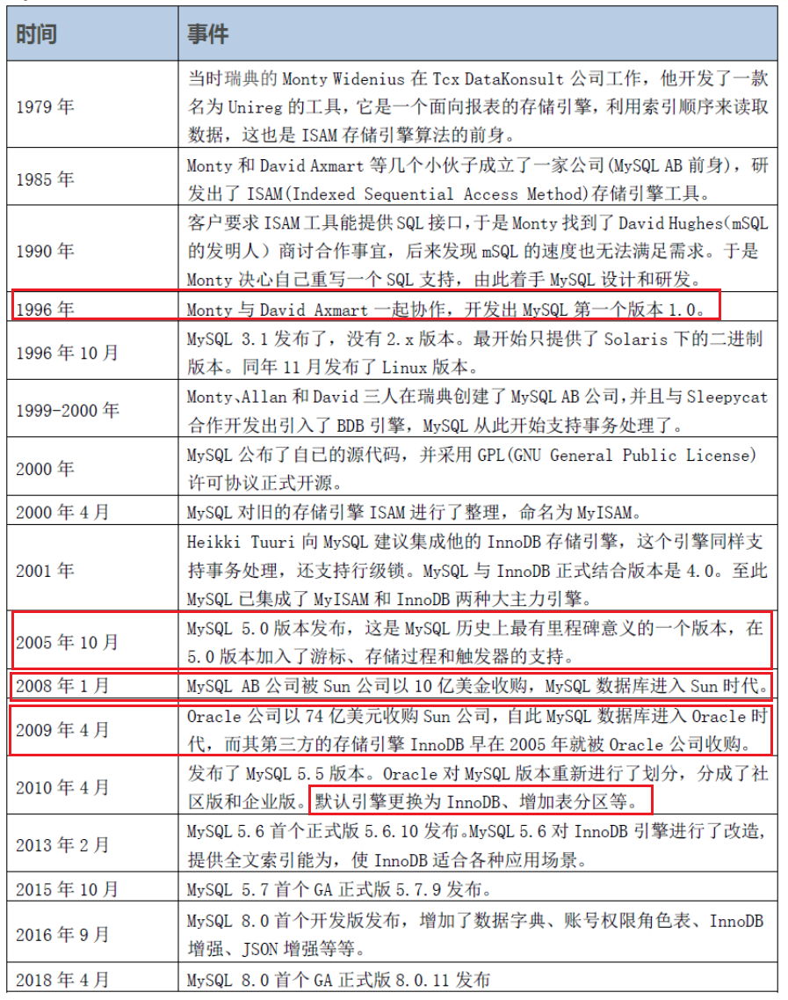
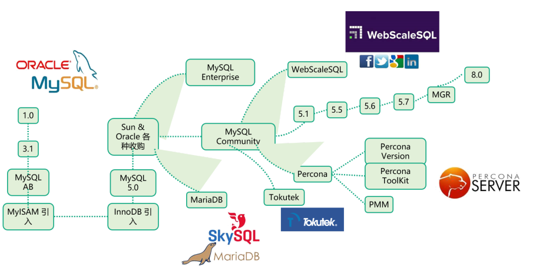
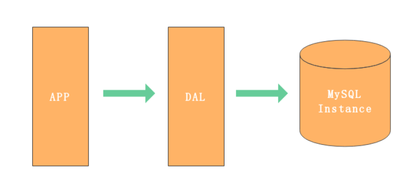
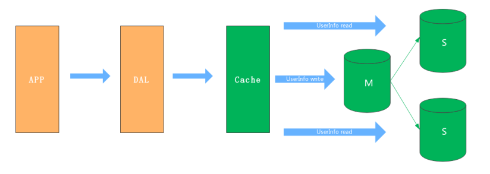
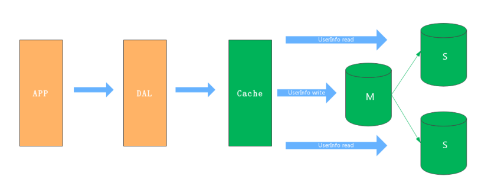
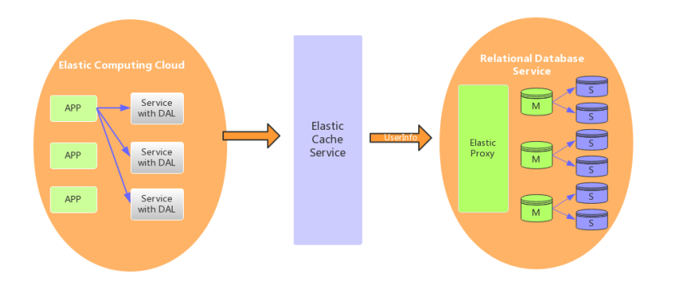
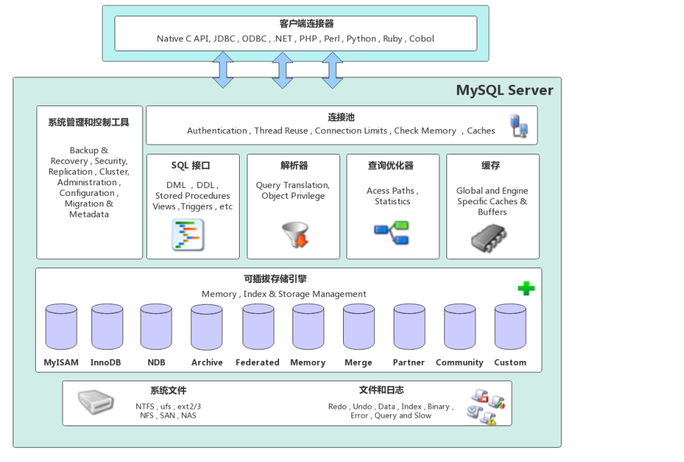

之前对MySQL也有过学习，但仅仅停留在会用的层面，下面通过这次学习，希望对MySQL有个更深入的认识

<!--more-->

# 一、MySQL发展历程

## 1. 历史节点

mysql发展主要有以下几个标志性节点

1. 1996年发布MySQL 1.0
2. 2005年发布MySQL 5.0版本，这是一个里程碑意义版本，支持了Oracle的许多功能
3. 2008年和2009年，大鱼吃小鱼，小鱼吃虾米，先后sum公司收购了MySQL AB 公司，Oracle公司收购了sun公司

MySQL主流分支架构

## 2. 应用架构演变

### （一）V1.0 单机架构

一个小型的网站，一台数据库服务器就能够满足数据的读取和写入，一般会把所有的数据写入一个MySQL instance中

#### 瓶颈

1. 数据量不能太大，并发访问能力弱
2. 服务器挂点，系统就会崩溃无法访问

### （二）主从架构

同步2台或多台服务器，一台M主库承担写压力，多台S子库承担读压力，对于写少读多的系统，采用主从架构能够解决数据库服务器读写压力多大的问题

#### 瓶颈

​		数据量不能太大，对于写要求比较高的场景，写服务器超出承受

### （三）分库分表

分库分表分垂直拆分和水平拆分，垂直拆分每个库都拥有完整的数据，水平拆分每个库拥有1/n数据，

水平拆分如何拆分、客户端请求怎么路由以及如何保持数据的一致性是个难题

### （四）云数据库

云数据库可以为公司节约成本，具有一定的优势，例如弹性扩容、便于管理，服务提供商提供详细的技术支撑

# 二、MySQL架构原理

MySQL架构自顶向下可分为网络连接层、服务层、存储引擎层、和系统文件层

## 1、网络连接层

