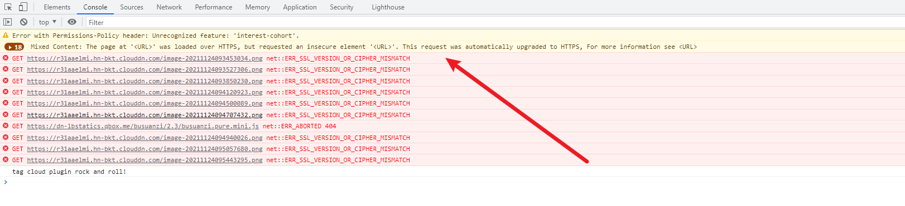
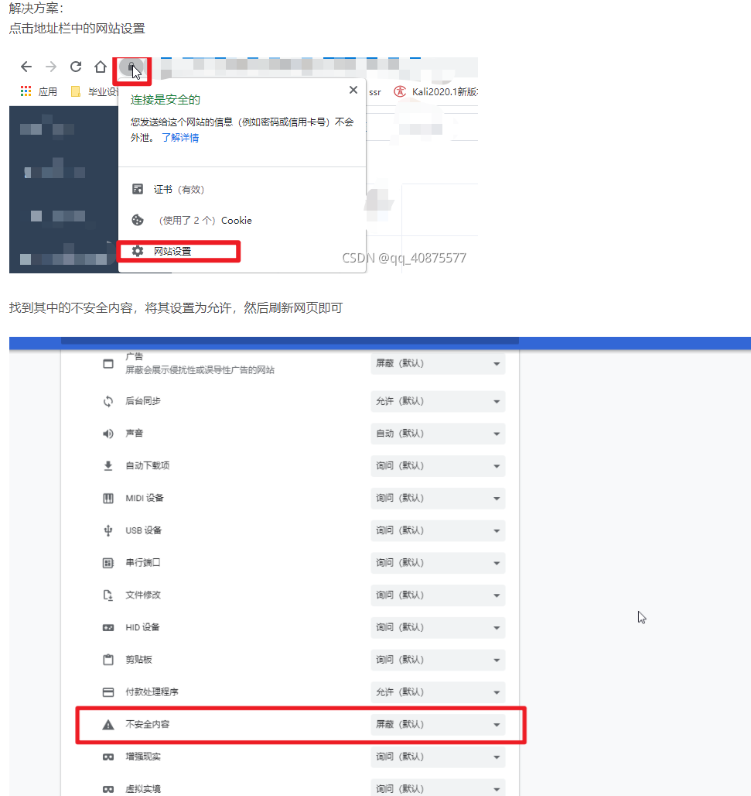

之前分享了《hexo搭配typora在文档中插入图片上传到github》，github作为代码存储仓库，放置图片总有些不合适，况且由于网络原因，加载效果并不是很好，因此，在这里推荐大家使用Typora+PicGO+七牛云来实现图片的云存储

<!--more-->

# 一、工具说明

## 1、Typora

typora大家都不陌生，是一款MarkDown语法的编辑工具，用来写笔记比较方便

具体介绍和获取方式，可以参照我的[实用工具介绍](https://liuzhengkaifa.github.io/2021/11/10/%E5%AE%9E%E7%94%A8%E5%B7%A5%E5%85%B7%E8%BD%AF%E4%BB%B6%E5%88%86%E4%BA%AB/#more)

## 2、PicGo

PicGo是一个用于快速上传图片并获取图片 URL 链接的工具，这个工具在GitHub上是开源的，我们可以访问直接下载

[PicGo开源GitHub点击跳转](https://github.com/Molunerfinn/PicGo)

## 3、七牛云

七牛云存储用来存储图片，通过typora实用PicGo实际上是将图片上传到七牛云提供的云存储服务器上，然后我们通过图片访问url就能快速访问图片

# 二、使用操作

## 1、下载工具和七牛云注册

* 下载[Typora](https://liuzhengkaifa.github.io/2021/11/10/%E5%AE%9E%E7%94%A8%E5%B7%A5%E5%85%B7%E8%BD%AF%E4%BB%B6%E5%88%86%E4%BA%AB/#more)和[PicGo](https://github.com/Molunerfinn/PicGo)

Typora进入官网下载即可，正常安装

PicGo进入GItHub网站，点击下载安装的**应用**，然后再新的页面下载exe可执行文件即可

软件正常安装即可，需要记住安装的地址，后面需要配置使用

* 注册七牛云账户

[点击跳转官网](https://portal.qiniu.com/)

注册认证完成后，在对象存储>>空间管理>>新建一个空间，后续备用

## 2、配置PicGo

软件安装完成后，打开PicGo

将七牛云个人中心的 `AK` 和 `SK`，分别配置到 PicGo >> 图床设置>>七牛图床  对应位置

然后在打开七牛云新建的空间，依次将空间名称、域名地址配到PicGo中（注意，域名配置中，需要添加http://或者https://），这里需要记一下，空间的存储区域在哪个位置，例如我的在华南。

然后对照这张表将对应的地域简称填到PicGo的存储区域中，至此，PicGo完成配置

## 3、Typora配置

Typora依次选择格式>>图像>>全局图像设置

在偏好设置处，先将 插入图片时改为上传图片，在上传服务设定处，选择上传服务为PicGo(app)，PicGo路径选择PicGo的安装路径

最后点击验证图片上产选项，如果成功的话至此所有配置完成。

## 4、测试

打开Typora,随便粘贴一张图片，看路径是否是配置的七牛云地址，以及图片是否能够正常显示。如果不能的话看看PicGo是否配置出错，例如协议是否加对了，将https://和http://切换试下。

至此完成配置使用，大家愉快的耍起来吧~

## 5、问题

这是看资源加载会发现本是http的数据资源会被强制加载成https

如果此页面图片无法正常显示，请点击[解决方案](https://blog.csdn.net/qq_40875577/article/details/120000269?spm=1001.2101.3001.6661.1&utm_medium=distribute.pc_relevant_t0.none-task-blog-2%7Edefault%7ECTRLIST%7Edefault-1.no_search_link&depth_1-utm_source=distribute.pc_relevant_t0.none-task-blog-2%7Edefault%7ECTRLIST%7Edefault-1.no_search_link)：

