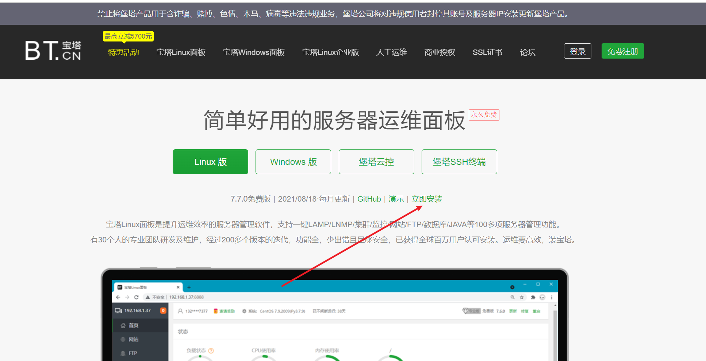
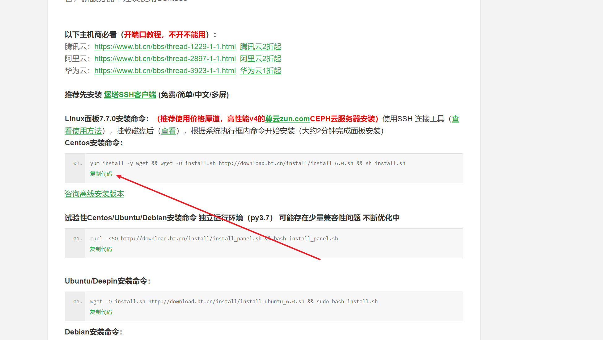
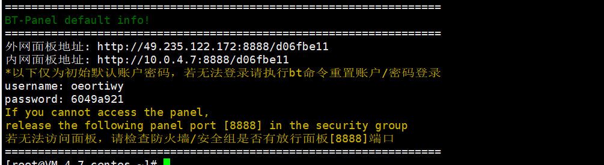
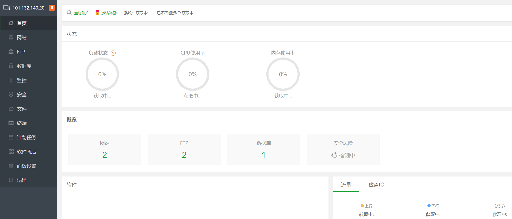
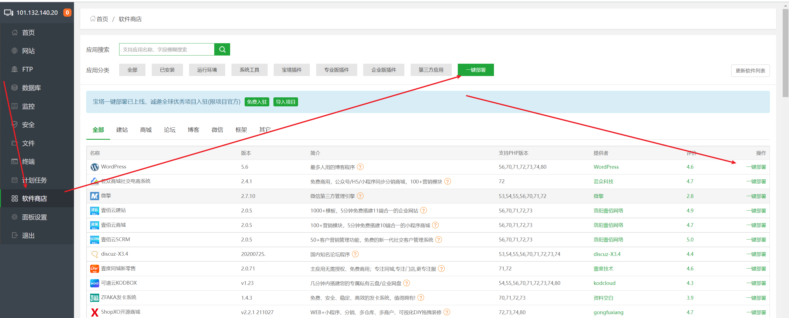
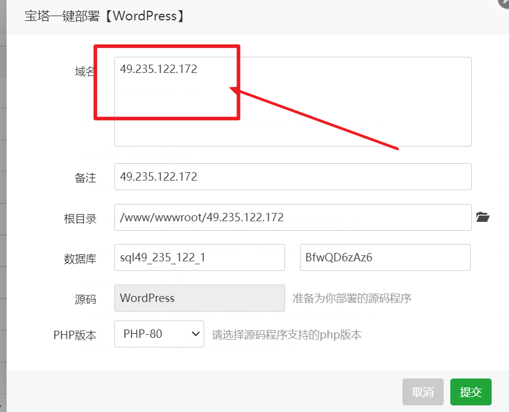
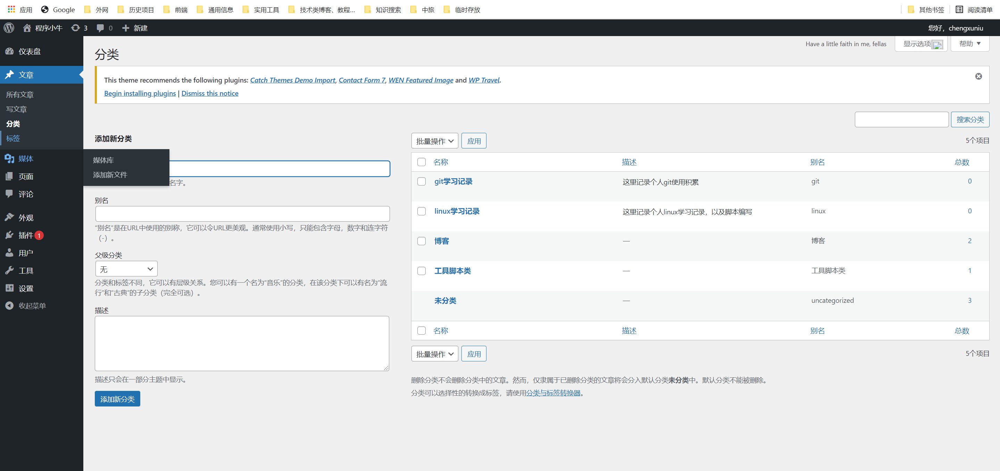

> 之前分享了一篇hexo搭建个人博客，详细内容可以访问：[本地搭建hexo博客并上传github](https://liuzhengkaifa.github.io/2021/11/09/%E6%88%91%E7%9A%84%E7%AC%AC%E4%B8%80%E7%AF%87%E5%8D%9A%E5%AE%A2%E6%96%87%E7%AB%A0/#more) 那么WordPress博客与hexo有什么区别呢,到底该使用哪个

## 一、WordPress与hexo的区别

1. 搭建wordpress需要一台服务器，个人的话可以买一台云服务器，经济允许可以考虑。
2. wordpress功能更加强大，定位为一款动态博客。拥有功能完整的后台管理系统，可以审核评论，切换各种主题插件等
3. hexo定位为静态网站博客，纯静态页面资源，无需个人服务器，上传到github或者码云均可访问
4. hexo采用markdown语法，更加简练符合程序员文档书写习惯
5. hexo无需维护额外服务器，界面干净简练，经过对比之后本人还是采用了hexo作为自己的个人博客

<!--more-->

## 二、安装WordPress

安装wordpress之前就不得不介绍介绍一款超强的运维服务器管理面板[**宝塔**](https://www.bt.cn/) ,通过宝塔可以减省对服务器的很多复杂操作：例如安装各种软件

> git、nginx、ftp、mysql、php(wordpress是基于php开发的)

### 1. 安装宝塔

通过添加宝塔官网的立即安装按钮跳转到安装指导页面

在打开的页面直接复制代码命令，在linux服务器终端执行即可自动安装成功

安装成功后，终端会返回宝塔的访问地址以及账号、密码，你需要把这些信息拷贝记下，通过浏览器访问即可

如果访问失败，尝试将云服务器的端口安全组8888放开即可

进入宝塔后根据提示下载行点击就会依次下载安装git、nginx、ftp、mysql、php、php-admin等软件，当然，你也可以从宝塔的软件商店自行下载

### 2.一键部署WordPress

1. 安装完宝塔后，以及相关的软件后，进入宝塔软件商店

2. 选择一键部署，就会看到WordPress，点击一键部署即可

3. 如果尚未拥有域名，域名处输入IP即可，点击提交

   

4. 提交完成后记录相关信息，在宝塔网站一栏即生成相应站点，此时在浏览器输入自己服务器ip地址即可登录WordPress,首次使用需要注册一个账号

5. 下面是WordPress的控制台，可以看出，功能还是相当强大，完全满足个人博客的基本需求，有想法的小伙伴赶紧行动起来

   

## 三、总结

1. 安装WordPress的过程是不是相当简单，不用敲一行代码即可完成，但是想要长期维护博客的同学要一直管理维护一台云服务器也是要仔细考虑是否有必要
2. 相对博客来说，个人觉得也许并不需要过多复杂的功能，hexo简洁的界面能够记录平时所想，定期维护到github上不是很香嘛，当然缺点也很明显，github是不是访问就断掉也是很让人心烦