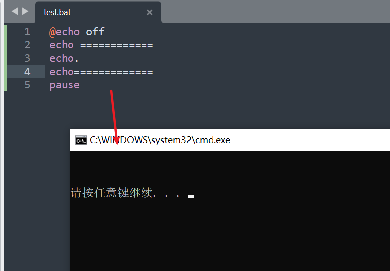
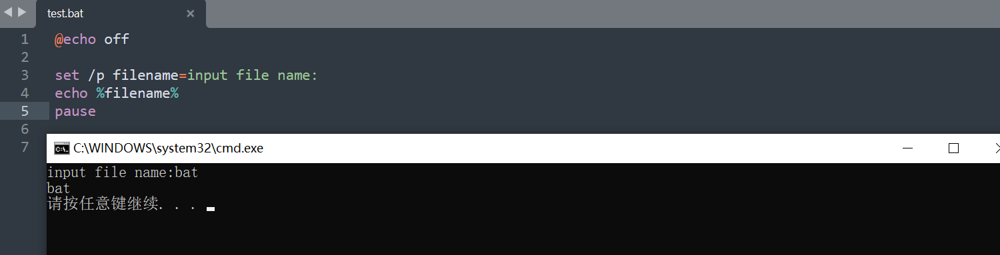
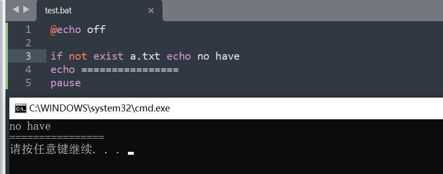
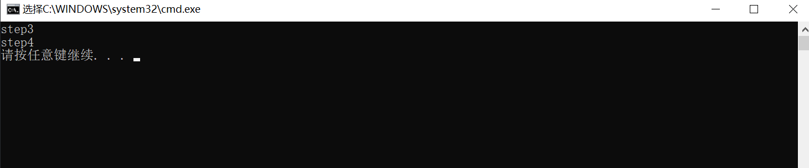
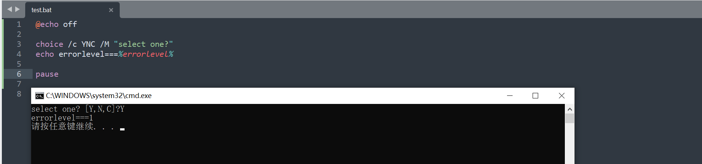

windows实用中，当我们经常需要进行重复的操作时，就可以考虑编写一个批处理脚本来简化重复的动作，批处理（Batch）往往以`.bat`结尾，其作用嘛：无非就是能够连续执行多条命令

<!--more-->

# 一、语法了解

## 1.变量

### （一）bat文件变量的赋值

```
set num=10
set name=xiaomin
```

### （二）bat文件变量的实用

```
echo %num%
echo %name%
```

## 2.常用命令

### 1、echo

1. ECHO [ON | OFF] 打开回显或关闭回显功能。

一般bat文件第一行都是@echo off,即关闭回显功能

echo off 代表这行后面的命令执行时都不再输出显示命令本身，@表示显示其后面的命令，对改行生效，所以搭配起来就是脚本执行不显示命令行本身

2. 另外echo具备输出和换行的功能；



### 2、pause

会暂停批处理的执行并在屏幕上显示请按任意键继续...的提示，等待用户按任意键后继续

一般用来让用户考虑是否继续执行，不执行的话关掉命令窗口即可

### 3、cls

清屏，执行到该命令时之前的输出将会clean

### 4、call

call [要执行的脚本路径+脚本名称] [要传递的参数]

调用另一个批处理程序，并且不终止父批处理程序

在执行完另一个脚本后仍然返回到当前的批处理程序继续执行

### 5、REM

语法：Rem Message...

(小技巧：用::代替rem)

```
::下面一行会输出hello
echo hello
```

### 6、/p

```
set /p filename=请输入文件名称
echo %filename%
```



### 7、if

if 表示将判断是否符合规定的条件，从而决定执行不同的命令。有三种格式:

1. 语法: if [not] "参数" == "字符串" 待执行的命令

参数如果等于(not表示不等，下同)指定的字符串，则条件成立，运行命令，否则运行下一句。(注意是两个等号)

```
@echo off

if "111"=="222" echo 111==222
echo ================
pause
```

2. 语法: if [not] exist [路径\]文件名 待执行的命令



3. 语法: if [not] errorlevel <数字> 待执行的命令

很多DOS程序在运行结束后会返回一个数字值用来表示程序运行的结果(或者状态)，称为错误码errorlevel或称返回码。

常见的返回码为0、1。通过if errorlevel命令可以判断程序的返回值，根据不同的返回值来决定执行不同的命令。

**if-else if-else **

注意：输出的括号和条件之间要留有空格，如果要换行else ，在if行尾需要加上`^`

```
set num=1
if %num%==0 (echo 111) else if %num%==2 (echo 222)^
else (echo 333)	
echo %num%
pause

输出：
333
1
```

### 8、goto

语法：goto label (label是参数，指定所要转向的批处理程序中的行。)

指定跳转到标签行，找到标签行后，程序将处理从下一行开始的命令。

label标签的名字可以随便起，但是最好是有意义的，字母前必须加个冒号“:”来表示这个字母是标签。

goto命令就是根据这个冒号来寻找下一步跳到到那里。经常与 if 配合使用，根据不同的条件来执行不同的命令组。

```
@echo off

GOTO step3
:step2
echo step2

:step3
echo step3

:step4
echo step4

pause
```

输出结果：



### 9、%~dp0

`%~dp0`代表脚本当前路径，即：

```
echo %~dp0
输出的结果：D:\kuaijie\

%~dp0 “d”为Drive的缩写，即为驱动器，磁盘、“p”为Path缩写，即为路径，目录

cd %~dp0 ：进入bat脚本所在目录

cd %~dp0bin\ ：进入bat脚本所在目录的bin目录
```

###  10、脚本间参数传递

%[1-9]表示参数，参数是指在运行批处理文件时在文件名后加的以空格(或者Tab)分隔的字符串。

变量可以从%0到%9，%0表示批处理命令本身，其它参数字符串用 %1 到 %9 顺序表示。

```
例如我执行：
call test.bat c1 2 3 4 5 6 7 8 9 a s

在test.bat脚本内部，$0=test.bat;$1=c1;$9=9;$19=c19
```

### 11、start

调用外部程序，所有的DOS命令和命令行程序都可由start命令来调用

例如:

```
start /d "D:\software" typora.ext "bat.md"
```

就可以运行d盘software目录下的typora.exe编辑器打开bat.md文件了

### 12、choice

CHOICE [/C choices] [/N] [/CS] [/T timeout /D choice] [/M text]

描述:
    该工具允许用户从选择列表选择一个项目并返回所选项目的索引。

参数列表:
   /C    choices       指定要创建的选项列表。默认列表是 "YN"。

   /M    text          指定提示之前要显示的消息。如果没有指定，工具只显示提示。

   /?                  显示此帮助消息。

示例：



###  13、exit 命令

结束程序。即时是被调用的程序，结束后也不会返回原程序


# 二、小技巧

### 1、实现pause功能，自定义输出内容

在bat文件最后实用set /p tmp=操作结束，请按回车键退出... 代替 pause

```
set /p tmp=操作结束，请按回车键退出...
```

### 2、在脚本中添加chcp 65001解决中文乱码

在脚本中文前方添加`chcp 65001`，cmd的编码格式就是UTF-8,仅当前脚本执行有效

或者把bat文件的编码改为ANSI，UTF-8在win10我这儿会中文显示乱码

### 3、进入指定盘符

cmd窗口中我们往往要先输入d:切换到D盘

然后再cd D:\blog进入D盘下目录，其实我们可以通过cd加参数 /d来直接进入任意盘符下目录

cd /d d:\blog

# 三、总结

bat脚本功能很多，这里只列了最最基本的一些使用，在后续实际需求中，我们可以思考用bat脚本如何提高自己的效率……