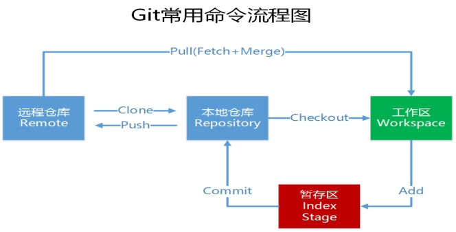
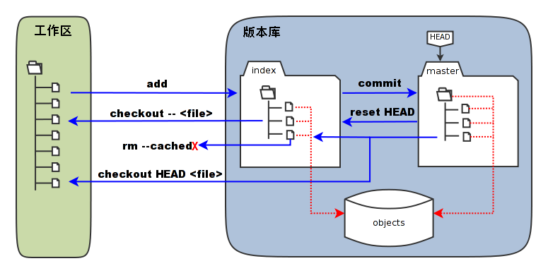
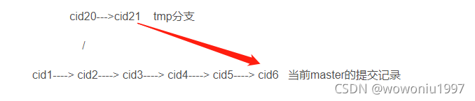

## 一、概述

git作为一款分布式版本控制工具，目前已逐渐成为开发团队首选的协作工具，相比SVN其优势不言而喻

1. 均有分布式思想，每个版本库都拥有完整的版本历史记录
2. 分支功能很强大，不像svn分了分支之后，合并代码要人工去比对，虽然有强大的文件比较工具[BeyondCompare](https://www.beyondcomparepro.com/) 加持，但仍然是人工操作，分支比较多，同时操作相同文件时冲突解决等不可避免出现问题。git通过merge能够自动合并分支代码，分支开发很大提高了协作效率。分支操作也会写在下面

<!--more-->

## 二、基础理解



### 1.相关概念

1. 工作区（workspace）:我们正常的文件夹
2. 本地仓库（Repository）:隐藏的.git文件夹
3. [暂存区](https://www.cnblogs.com/cposture/p/4178003.html)：简而言之即使文件索引，建立了文件和.git/objects目录下的对象实体之间的映射关系



4. 远程仓库（Remote）:一般是存放在服务器上，本地通过 git push将代码推送到远程

## 三、分支操作

### 一、分支管理（git协作管理规范）

实际开发的时候，一人一条分支。除此之外还要有一条devlop开发分支，一条test分支,一条release预发布分支

1. **develop**开发分支，开发共用的分支，开发人员每天都需要拉取/提交最新代码的分支；
2. **test**测试分支，发人员开发完并自测通过后，发布到测试环境的分支；
3. **release**预发布分支，测试环境测试通过后，将测试分支的代码发布到预发环境的分支（这个得看公司支不支持预发环境，没有的话就可以不采用这条分支）
4. **master**生产分支，预发环境测试通过后，运营/测试会将此分支代码发布到线上环境；

开发流程：

- 开发人员每天都需要拉取/提交最新的代码到 **「develop 分支」**；
- 开发人员开发完毕，开始 **「集成测试」**，测试无误后提交到 **「test 分支」**并发布到测试环境，交由测试人员测试；
- 测试环境通过后，发布到 **「release 分支」** 上，进行预发环境测试；
- 预发环境通过后，发布到 **「master 分支」**上并打上标签（tag）；
- 如果线上分支出了 bug ，这时候相关开发者应该基于预发布分支（**「没有预发环境，就使用 master 分支」**），新建一个 **「bug 分支」**用来临时解决 bug ，处理完后申请合并到 预发布 分支。这样做的好处就是：不会影响正在开发中的功能。

**「预发布环境的作用：」** 预发布环境是正式发布前最后一次测试。因为在少数情况下即使预发布通过了，都不能保证正式生产环境可以100%不出问题；预发布环境的配置，数据库等都是跟线上一样；有些公司的预发布环境数据库是连接线上环境，有些公司预发布环境是单独的数据库；如果不设预发布环境，如果开发合并代码有问题，会直接将问题发布到线上，增加维护的成本。

 对分支的操作是轻量级的

### 二、分支图解

如下图，当前有两个分支，ACE属于mster分支，而BDF属于dev分支，他们的head指针分别指向E和F

```
A----C----E(master)
\
 B---D----F(dev)
```


对上述做如下操作

```java
git checkout mster //选择 or 切换 到mster分支
git merge dev      //将dev分支合并到当前分支（mster）中
```


分支合并完成后

```
A----C----E----G(mster)
\              /
  B-----D----F
```


现在ABCDEFG属于mster分支，G是一次E和F合并后的结果，可能会出现冲突。而ABDF依然属于dev分支，可以继续再dev的分支上进行开发

```
A----C----E----G(mster)
\              /
  B-----D----F ------I(dev)
```


### 三、分支的基本操作

1. git branch //查看本地的所有分支
2. git branch -r //查看远程所有分支
3. git branch -a //查看本地和远程的所有分支
4. git branch \<branchname>   //新建分支
5. git branch -d \<branchname> //删除本地分支
6. git branch -d -r \<branchname> //删除远程分支，删除后还需推送到服务器
7. git branch origin:\<branchname> //删除后推送至服务器
8. git branch -m \<oldbranch> \<newbranch> //重命名本地分支
9. git checkout \<branchname>//切换分支
10. git checkout -b \<branchname>//创建并切换分行之
11. git checkout -b \<branchname> origin:\<remoteBranchName>//创建分支并切换，分支跟远程分支保持一致

## 四、常用操作

### 1、基本命令

```
1.git init --初始化git仓库
2.git clone url [dir] --克隆远程仓库到本地 [dir]代表克隆存放到的本地文件夹
3.git config –global user.name [username] --全局提交的用户名
4.git config –global user.email[email] --全局提交的额邮箱
```

### 2、git remote

```
git remote --查看已经配置的远程仓库服务器
git remote add [shortname] [url] --为本地仓库添加远程仓库
```

### 3、git merge

合并分支，例如：将test分支合到master分支，并推动到远程仓库

```
1.git checkout master   --切换到master分支
2.git merge test  --将test分支河道master分支
3.git pust --推送到远程仓库
```

### 4、git stash

git stash可以将当前分支未提交的修改推到Git的栈中，然后切到其他分支进行操作，返回当前分支后再释放就能完整恢复离开前状态

```
1.git stash --将当前分支的修改提交到git栈中，stash是本地的，不会通过git push命令传到git 服务器上
2.git stash save "test-cmd-stash" --实际应用中使用git stash save 取代git stash 命令，添加一个message信息
3.git stash pop  --恢复之前缓存的工作目录
```


### 5、git fetch 用法

git fetch 命令：

```
$ git fetch <远程主机名> //这个命令将某个远程主机的更新全部取回本地
```

如果只想取回特定分支的更新，可以指定分支名：

```
$ git fetch <远程主机名> <分支名> //注意之间有空格
```

最常见的命令如取回`origin` 主机的`master` 分支：

```
$ git fetch origin master
```

取回更新后，会返回一个`FETCH_HEAD` ，指的是某个branch在服务器上的最新状态，我们可以在本地通过它查看刚取回的更新信息：

```
$ git log -p FETCH_HEAD
```

可以看到返回的信息包括更新的文件名，更新的作者和时间，以及更新的代码（19行红色[删除]和绿色[新增]部分）。

我们可以通过这些信息来判断是否产生冲突，以确定是否将更新merge到当前分支。 

2、git pull 用法

前面提到，`git pull` 的过程可以理解为：

```
git fetch origin master //从远程主机的master分支拉取最新内容

git merge FETCH_HEAD //将拉取下来的最新内容合并到当前所在的分支中
```

即将远程主机的某个分支的更新取回，并与本地指定的分支合并，完整格式可表示为：

```
$ git pull <远程主机名> <远程分支名>:<本地分支名>
```

如果远程分支是与当前分支合并，则冒号后面的部分可以省略：

```
$ git pull origin next
```


### 6、git pull --rebase 和git pull的区别

```
git pull = git fecth + git merge FETCH_HEAD
 git pull -- rebase = git fetch + git rebase FETCH_HEAD
```

二者的区别是，在fetch之后的操作不同，**merge与rebase的不同**

假设当前mster的提交操作如下：

cid1----> cid2----> cid3----> cid4----> cid5        --当前master的提交记录

当开发同事在cid2点，开发进度是cid20(或者突然撇出一个分支，假设是tmp分支），此时要把cid20提交到master

```
 cid20--->cid21  tmp分支
        /
cid1----> cid2----> cid3----> cid4----> cid5  当前master的提交记录
```


在master执行  git merge tmp , 然后会得到如下结果

​     

那么来看看git rebase，在mster执行 git rebase tmp 操作之后的分支如下

cid1----> cid2----> cid20----> cid21----> cid3‘----> cid4’----> cid5‘  当前master的提交记录

 二者对比可知，**rebase没有产生新的节点，使用rebase的git演进路线(提交树)是一直向前的，这样在版本回退时也很容易**，用merge的git路线是跳跃的，如果版本回退你也找不到自己想要的版本，如果在merge时出现了冲突那就麻烦了，当前merge就不能继续进行下去，需要手动修改冲突内容后，add，commit, push. 而rebase 操作的话，会中断rebase,同时会提示去解决冲突。解决冲突后, 再执行 git rebase –continue 继续操作，再push.