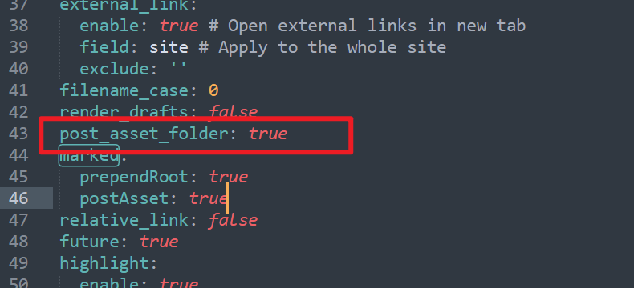
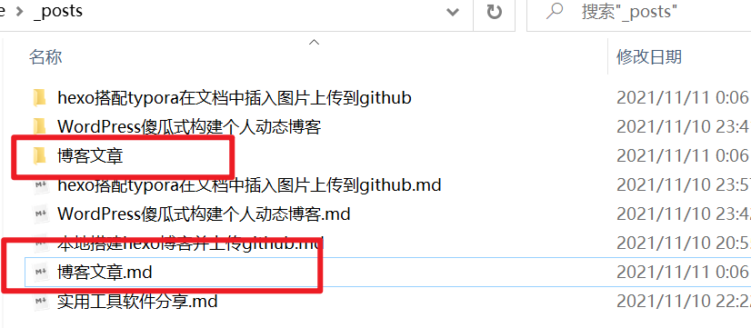
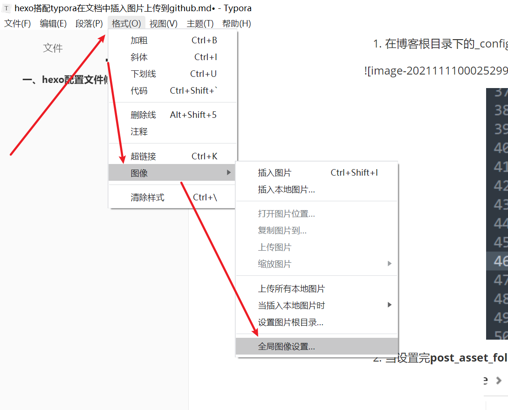
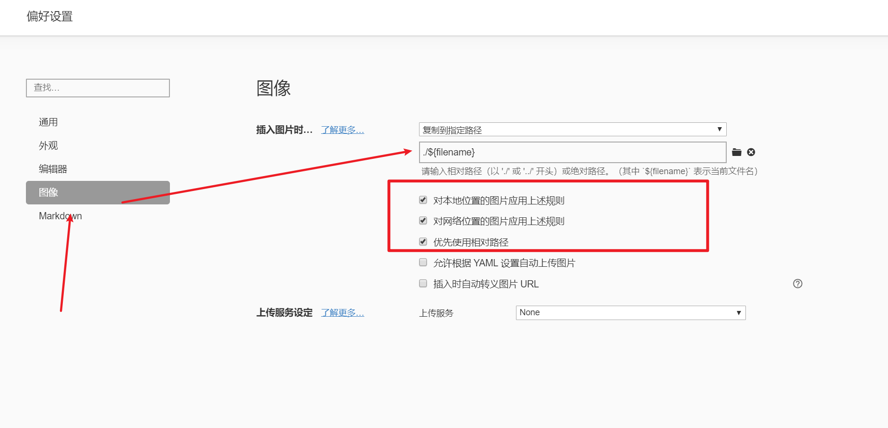

由于hexo本地图片路径和上传到github服务器上的路径不同，使用typora设置相对路径也会有问题，为了解决文章在本地插入图片和在服务器预览效果一致，跟随一下步骤即可完美解决

## 一、hexo配置文件修改

1. 在博客根目录下的_config.yml文件中，找到**post_asset_folder**字段，属性值设为**true**

<!--more-->

2. 当设置完**post_asset_folder**字段值后，使用hexo new "博客名称" 时，会生成一个博客名称文件夹和博客名称.md文件

   

   3. 在文章使用中的资源可以放到对应的文件夹里，可以方便区分，这样也有一个问题，插入一张图片放一张，然后在编辑器上去引相对路径，不是很麻烦吗，答案是结合typora设置一下即可完美解决

   ## 二、设置Typora

   1. typora 点击格式>>图像>>全局图像设置

   

   2. 在偏好设置处修改复制到指定路径

3. 操作完成后，粘贴在文档的图片都会自动复制到跟文件同名的文件夹中去，也不用单独去存放图片和写相对路径了，是不是很nice

## 三、装插件

操作到当前步骤还未结束，

需要到博客的根目录下执行 npm install [https://github.com/CodeFalling/hexo-asset-image](https://link.jianshu.com/?t=https%3A%2F%2Fgithub.com%2FCodeFalling%2Fhexo-asset-image) --save 命令来进行插件的安装。

以便在服务器上访问图片和本地预览访问的图片都能够正常显示

至此，图片问题解决，可以图文写作不是很棒嘛~

