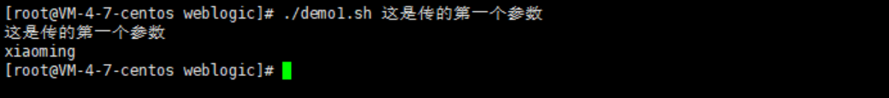
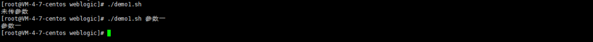
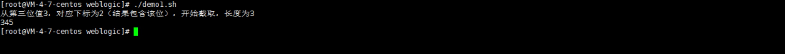
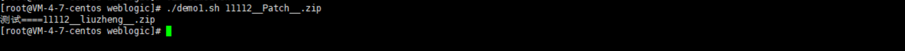

使用shell脚本在linux服务器上可以帮助我们处理很多工作，想要追求效率，会编写shell脚本是非常有必要的

# 一、快速开始

1. 创建一个新shell文件

```
vi demo.sh
```

2. 添加脚本头文件

```
#bin/sh
```

3. 授权和执行

```
chmod 777 demo.sh -授权
./demo.sh    -执行
```

示例脚本demo.sh：

```
#bin/sh
echo hello world
```

# 二、常用语法

### 1、变量的赋值和使用

`$1` 代表输入执行脚本传递来的第一个参数，变量赋值时不需要带$符号，在输出使用时需要带

**变量两边不能加空格**

示例：demo1.sh

```
#bin/sh
name=xiaoming
echo $1
echo $name
```

执行

```
./demo1.sh 这是传的第一个参数
```

运行结果



### 2、if else 和 Case 判断

#### （一）if else

**注意 if 和 [ 之间要有空格，= 号两边也要有空格**

示例代码：

```
if [ "$1" = "" ] ; then
    echo 未传参数
    exit
else
    echo $1
fi
```



#### （二）Case

类似`java`语法中的`switch-case`选择

示例代码：如果输入的参数有38的话，将执行ips+=('172.XXX.XX.38')，有40的话将执行 ips+=('172.XXX.XX.40')，

都不符合条件将执行最后的提示echo "请输入正确服务器ip编号"

```bash
ips=() 
case $1 in 
        "38")
		ips+=('172.XXX.XX.38')
		;;
	"40")
        ips+=('172.XXX.XX.40')
         ;;
	*)
	echo "请输入正确服务器ip编号"
	;;
esac
```

### 3、常用的一些文件表达式

#### （一）文件表达式

| 表达式                  | 含义                                 |
| ----------------------- | ------------------------------------ |
| -e filename             | 如果 filename存在，则为真            |
| -f filename             | 如果 filename为常规文件，则为真      |
| -L filename             | 如果 filename为符号链接，则为真      |
| -r filename             | 如果 filename可读，则为真            |
| -w filename             | 如果 filename可写，则为真            |
| -x filename             | 如果 filename可执行，则为真          |
| -s filename             | 如果文件长度不为0，则为真            |
| -h filename             | 如果文件是软链接，则为真             |
| filename1 -nt filename2 | 如果 filename1比 filename2新，则为真 |
| filename1 -ot filename2 | 如果 filename1比 filename2旧，则为真 |

#### （二）整数变量表达式

| 表达式 | 含义     |
| ------ | -------- |
| -eq    | 等于     |
| -ne    | 不等于   |
| -gt    | 大于     |
| -ge    | 大于等于 |
| -lt    | 小于     |
| -le    | 小于等于 |

#### （三）字符串变量表达式

| 表达式                        | 含义                                                       |
| ----------------------------- | ---------------------------------------------------------- |
| If  [ $a = $b ]               | 如果string1等于string2，则为真；字符串允许使用赋值号做等号 |
| if  [ $string1 !=  $string2 ] | 如果string1不等于string2，则为真                           |
| if  [ -n $string  ]           | 如果string 非空(非0），返回0(true)                         |
| if  [ -z $string  ]           | 如果string 为空，则为真                                    |
| if  [ $sting ]                | 如果string 非空，返回0 (和-n类似)                          |

#### （四）逻辑表达式

| 说明      | 表达式                                  | 含义                       |
| --------- | --------------------------------------- | -------------------------- |
| 逻辑非！  | if [ ! 表达式 ] 示例： if [ ! -d $num ] | 如果不存在目录$num         |
| 逻辑与 –a | if [ 表达式1  –a  表达式2 ]             | 条件表达式的并列，并的意思 |
| 逻辑或 -o | if [ 表达式1  –o 表达式2 ]              | 条件表达式的或             |

### 4、字符串处理

#### （一）字符串截取表达式

示例：${1:0:10} 

大括号中的第一位是变量，1代表输入的第一个参数值，中间参数代表变量字符串开始位置，最后一个参数代表截取长度。

```
#bin/sh
str="12345678"
echo "从第三位值3，对应下标为2（结果包含该位），开始截取，长度为3"
echo ${str:2:3}
```



#### （二）字符串值替换表达式

${str/aaa/bbb} 

str：变量字符串，和$str内容一样，aaa：要替换上去的字符串，bbb：变量str上含有的字符串

示例：将输入的内容Patch 替换为liuzheng

```
#bin/sh
echo "测试====${1/Patch/liuzheng}"
```



### 5、数组和map集合

#### （一）数组

1. 数组定义

```
#1.定义一个空数组
arr=()
#2.定义数组并赋初始值
arr=('38' '40')
```

2. 获取数组长度

```
length=${#arr[*]}
echo $length
```

3. 数组添加新元素

```
arr+=('55')
```

4. 读取数组值

```
${arr[index]} #index 为元素在下标中的位置，从0开始
${arr[*]} #获取数组中所有元素，示例输出：数组的元素为: A B C D
```

5. 数组删除某一元素

```
unset arr[index] #删除数组下标index元素
```

#### （二）map集合

在shell脚本中也可以使用map，这对我们有键值对需求的存储提供了方便

1. map声明

在使用map时，需要先声明，否则结果可能与预期不同，array可以不声明

```
declare -A map
```

2. map初始化

与array类似，可以使用括号直接初始化，也可以通过添加的方式来初始化数据

与array不同的是，括号直接初始化时使用的为一个键值对，添加元素时，下标可以不是整数

```
map=(["aa"]="11" ["bb"]="22")
map["name"]="val"
map["apple"]="pen"
```

3. 输出所有key

若未使用declare声明map，则此处将输出0，与预期输出不符，此处输出语句格式比arry多了一个！

```
echo ${!map[@]}
```

4. 输出所有value

与array输出格式相同

```
echo ${map[@]}
```

5. 输出map长度

与array输出格式相同

```
echo ${#map[@]}
```

6. 遍历所有key

```
for key in ${!map[@]};do
    echo $key
done
```

7. 遍历所有value

```
for val in ${map[@]};do
    echo $val
done
```

8. 遍历，根据key，找到value

```
for key in ${!map[*]};do
    echo ${map[$key]}
done
```

### 6、循环遍历

此处是循环遍历了一个数组arr:

```
for ip in ${arr[*]}; do
   echo $ip
done
```

# 三、常用指令

### 1、echo

输出命令，常用来做一些提示信息

搭配一些字字体颜色或者字背景颜色区分性更强，可以参考：[Shell~echo -e 颜色输出](https://www.cnblogs.com/ElegantSmile/p/11144879.html)

### 2、zip、unzip

zip -qr [目标文件名] [源文件名]

- -q 不显示指令执行过程。
- -r 递归处理，将指定目录下的所有文件和子目录一并处理。

unzip xxx.zip

将xxx.zip解压到当前目录

### 3、rsync

rsync 是一个常用的 Linux 应用程序，用于文件同步

基本用法

```
rsync -r source destination
```

上面命令中，`-r`表示递归，即包含子目录。注意，`-r`是必须的，否则 rsync 运行不会成功。`source`目录表示源目录，`destination`表示目标目录。

搭配sshpass可以实现服务器之间的目录文件同步

```
sshpass -p "IP地址" rsync -rvc --delete 本机目录一 本机目录二 用户名@$ip:远程服务目录

#项目中使用的
/usr/local/bin/sshpass -p "${ipmaps[$key]}" rsync -rvc --delete $appdir/citsonline $appdir/citsb2b weblogic@$ip:$appdir
```

[rsync 详细用法教程](http://www.ruanyifeng.com/blog/2020/08/rsync.html)

### 4、sshpass

sshpass需要安装，可以通过显性配置账密，实现服务器之间无需手动输入密码进行交互，除了上面的rsync通过sshpass实现免密同步目录文件信息操作

还可以实现服务器间脚本远程执行

```
sshpass -p "密码" ssh 有户名@"IP地址" "/home/newStop.sh" #远程脚本
```

# 四、总结

目前我也是一边学习使用一边记录，这个文章才是冰山一角，后面在使用到过程中继续不断补充完善~~~