博文介绍了普通hash算法、一致性hash算法、一致性hash算法在Nginx负载均衡策略中的应用，文章主要来源拉钩高薪训练营相关内容+自己的理解，条理清晰，能够帮助理解hash算法到底在查询和存储过程或者是负载均衡中到底起了什么样的作用，为什么会有那么高的效率?有兴趣的小伙伴可以了解下

<!--more-->

# 一、普通Hash算法

## 1、哈希算法的用处

哈希算法主要用于数据查询、存储、安全加密等领域，例如Java中的HashTable,Git中的索引，MD5、SHA等

## 2、为什么要使用Hash算法

查询效率高，hash算法设计好的话，使用hash算法查询时间复杂度能够达到n(1)，即实现一次查询。

## 3、Hash算法到底是什么

hash算法不是一种算法，而是**一类算法**。

主要都是实现：**给一个任意大小的数据生成一个固定长度的数据，作为它的一个映射，一一对应**。

下面通过一个最普通简单的hash算法（除留余数法）来理解下hash算法：

就是给定一个固定长度的数组，和一个数

hash算法：就是将这个数对数组长度进行求模（即求余数），得到的结果就是哈希值

那么这个数和这个哈希值就建立了一一对应的关系，将这个数即可存放在数组下标值为它的哈希值的数组中，因此，判断这个数组有没有这个值时，只需要计算出这个值的hash值，直接根据数组下标查询是否为空即可得出结论。

**问题**：上面是最简单的hash算法，肯定会有问题出现，如多个数据通过求余数得到的结果一直，怎么都存在一个下标处，这就产生了hash冲突，解决的方法有开发寻址法，和拉链法，后面会讲到。这只是个示例，实际的hash算法要复杂很多，而且hash算法的研究一直在持续~


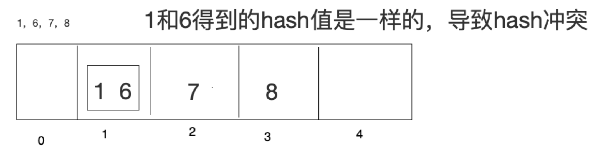

1. 开发寻址法

如果数据是1， 6， 7， 8，把这4个数据存储到上⾯的数组中 

开发寻址法的解决策略：

1 放进去了， 6再来的时候，向前或者向后找空闲位置存放

缺陷:

如果数组⻓度定义好了⽐如10，⻓度不能扩展，来了11个数据，不管Hash冲突不冲突，肯定存不下这么多数据 

2. 拉链法

数据⻓度定义好了，怎么存储更多内容呢，算好Hash值，在数组元素存储位置放了⼀个链表  


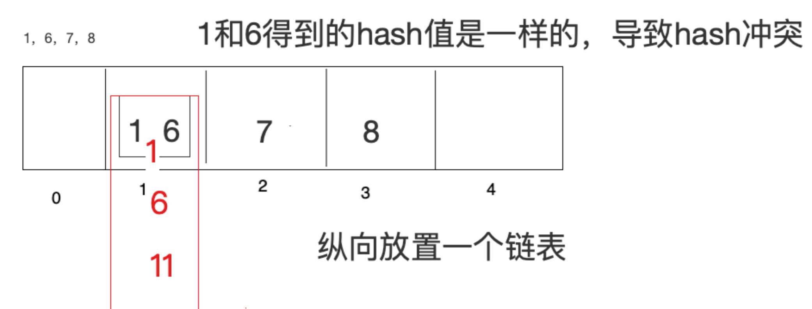

如果Hash算法设计的⽐较好的话，那么查询效率会更接近于O(1)，如果Hash算法设计的⽐较low，那么
查询效率就会很低了  

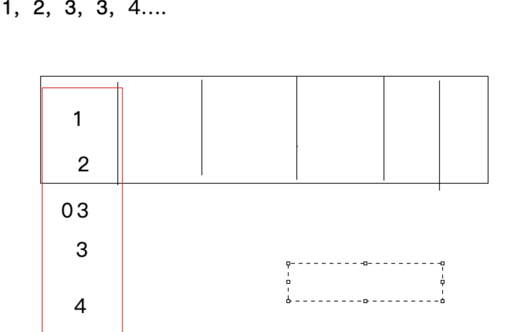

因此，Hahs表的查询效率高不高取决于Hash算法，Hash算法能够让数据平均分布，既能够节省空间，又能够提高查询效率。Hash算法的研究是一门很高深的学问，甚至很多数学见也在研究中。

HashCode就是通过一种hash算法得出的。

# 二、一致性哈希算法

## 1、普通Hash算法的弊端

例如Nginx自带的负载均衡策略ip_hash来说，根据IP地址的局域网段通过hash算法，将访问同一网段的客户端请求转发到同一台实现负载均衡的服务器上，虽然这样会避免session一致性问题，但是当其中一台服务器宕机了，根据求模得到的hash值便要重新计算，重新得到的hash值会将之前部分客户端请求转发到其它服务器上，从而会丢失sesssion登录信息等。

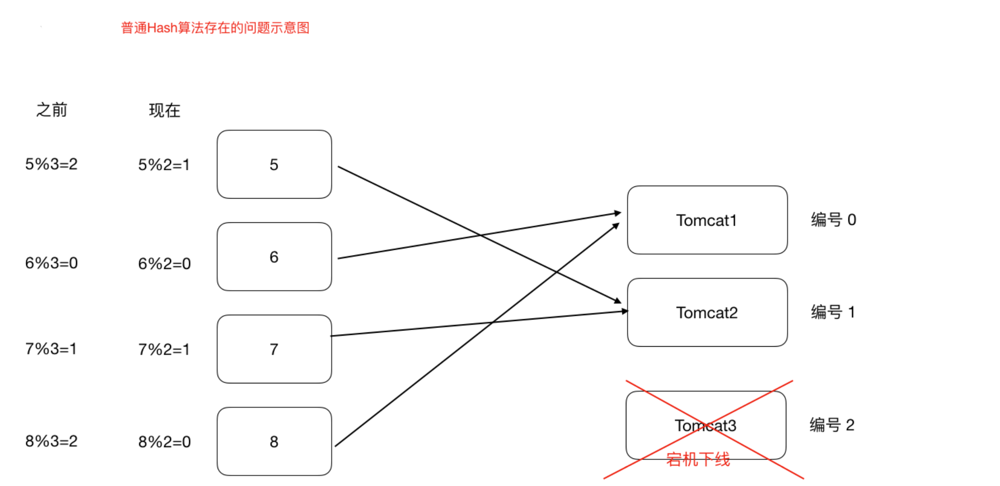

因为搭建了集群的服务器生产情况下，后台服务器很多，访问的客户端也有很多，所以一台宕机或者新增一台服务器影响会是很大的。缩容和扩容都会存在这样的问题，大量的用户请求会被转发到其它服务器上，保存在之前服务器中的会话信息便会丢失。

## 2、应用场景

### （一）Hash算法在分布式架构中的应用场景：

​		hash算法在分布式集群产品中都有应用，比如分布式集群架构Redis,Hadoop,ElasticSearch，Mysql分库分表， Nginx负载均衡等 

###  （二）应用场景归纳

1. 请求的负载均衡（比如Nginx的ip_hash）

Nginx的ip_hash在上面已经描述过了，虽然有弊端，但是也是实现了在客户端IP地址不变的情况下，将其发出的请求始终路由到同一台服务器上，实现会话粘滞，避免处理session共享问题

如果没有ip_hash策略，怎么实现会话粘滞

​	可以维护⼀张映射表，存储客户端IP或者sessionid与具体⽬标服务器的映射关系  

​	<ip,tomcat1>
缺点

1. 那么，在客户端很多的情况下，映射表⾮常⼤，浪费内存空间
2. 客户端上下线，⽬标服务器上下线，都会导致重新维护映射表，映射表维护成本很大

如果使⽤哈希算法，事情就简单很多，我们可以对ip地址或者sessionid进⾏计算哈希值，哈希值与服务
器数量进⾏取模运算，得到的值就是当前请求应该被路由到的服务器编号，如此，同⼀个客户端ip发送
过来的请求就可以路由到同⼀个⽬标服务器，实现会话粘滞。 

2. 分布式存储

以分布式内存数据库Redis为例,集群中有redis1， redis2， redis3 三台Redis服务器那么,在进⾏数据存储时,<key1,value1>数据存储到哪个服务器当中呢？针对key进⾏hash处理hash(key1)%3=index, 使⽤余数index锁定存储的具体服务器节点  

### （三）什么是一致性Hash算法

一致性hash算法的思路：

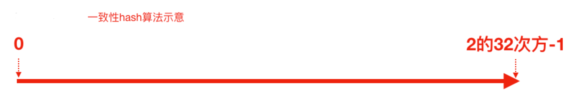

有这样一条直线，起始从0开始，结束为2的32次方-1，这也是Integer整数的取值范围，我们把它相当于地址，我们将这样一条线弯曲闭成一个环形，这样一个圆环我们就称之为**hash环**，我们把服务器的ip地址或者主机名求hash值然后对应到hash环上，那么针对客户端ip地址进行hash求值，对应到环上的某个位置，然后如何确定一个客户端的请求该由那一台服务器处理呢，即可按照hash环的顺时针方向，最近的服务器即处理来自hash环上的客户端请求

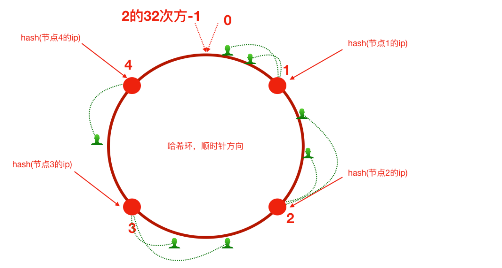

这样的话，当hash环上的服务区3宕机下线，原来请求路由到3上的客户端会被转发到服务器4，而其它客户端请求则不会收到影响，使得请求的迁移达到了最小，对客户端的影响也降低了，这样的算法对于分布式来说是非常合适的

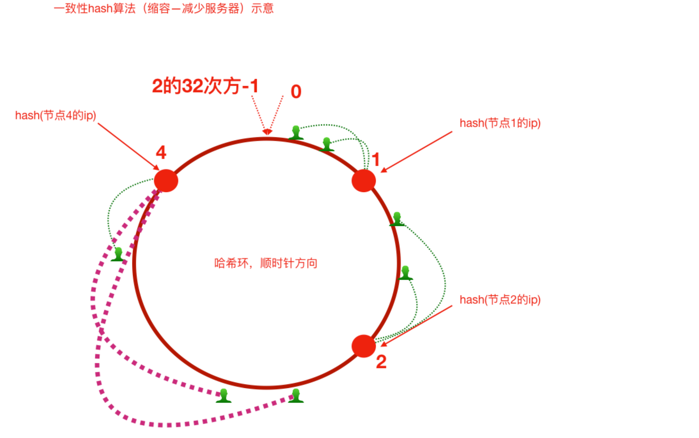

增加服务器5之后，原来路由到3的部分客户端路由到新增服务器5上，对于其他客户端没有影响只是这⼀⼩部分受影响（请求的迁移达到了最⼩，这样的算法对分布式集群来说⾮常合适的，避免了⼤量请求迁移 ）  

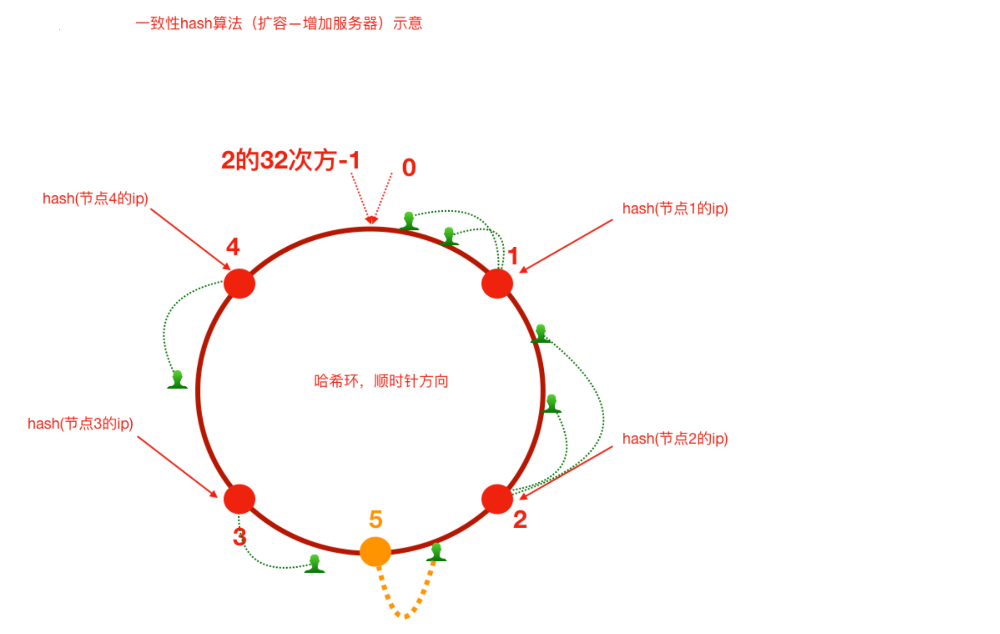

1. 优势

如前所述，每⼀台服务器负责⼀段，⼀致性哈希算法对于节点的增减都只需重定位环空间中的⼀⼩部分数据，具有较好的容错性和可扩展性。  

2. 弊端

但是，⼀致性哈希算法在服务节点太少时，容易因为节点分部不均匀⽽造成数据倾斜问题。例如系统中只有两台服务器，其环分布如下，节点2只能负责⾮常⼩的⼀段，⼤量的客户端请求落在了节点1上，这就是数据（请求）倾斜问题  

#### 1、增加虚拟节点

为了解决这种数据倾斜问题，⼀致性哈希算法引⼊了虚拟节点机制，即对每⼀个服务节点计算多个哈希，每个计算结果位置都放置⼀个此服务节点，称为虚拟节点  

具体做法可以在服务器ip或主机名的后⾯增加编号来实现。⽐如，可以为每台服务器计算三个虚拟节点，于是可以分别计算 “节点1的ip#1”、 “节点1的ip#2”、 “节点1的ip#3”、 “节点2的ip#1”、 “节点2的ip#2”、 “节点2的ip#3”的哈希值，于是形成六个虚拟节点，当客户端被路由到虚拟节点的时候其实是被路由到该虚拟节点所对应的真实节点  

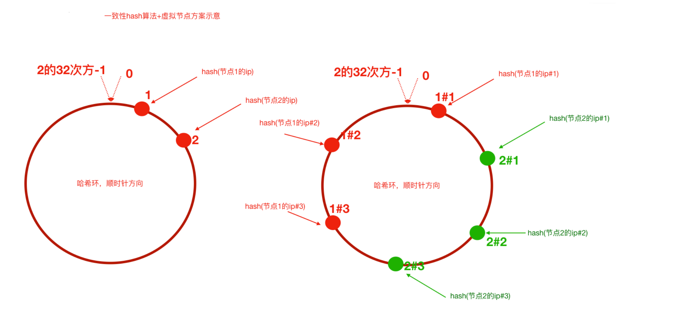

## 3、手写实现简单hash算法和一致性hash算法

### （一）普通hash算法实现

```
public class GeneralHash {
    public static void main(String[] args) {
        //1.定义客户端IP
        String[] clients = new String[]{"192.168.0.1","192.168.0.2","192.168.0.3"};

        //2.定义服务器数量
        int serverCount = 5;

        //使用hash(ip)%serverCount = index 根据index索引锁定应该路由到的tomcat服务器
        for (String client:clients) {
            int client_hash = Math.abs(client.hashCode());
            int index = client_hash%serverCount;
            System.out.println(client+"请求被转发到了服务器："+index);
        }
    }
}
```

### （二）一致性hash算法不带虚拟节点

```
public class ConsistentHashNoVirtual {

    public static void main(String[] args) {
        //step1 初始化：把服务器节点IP的哈希值对应到哈希环上
        // 定义服务器ip
        String[] tomcatServers = new String[]{"123.111.0.0","123.101.3.1","111.20.35.2","123.98.26.3"};

        SortedMap<Integer,String> hashServerMap = new TreeMap<>();


        for(String tomcatServer: tomcatServers) {
            // 求出每一个ip的hash值，对应到hash环上，存储hash值与ip的对应关系
            int serverHash = Math.abs(tomcatServer.hashCode());
            // 存储hash值与ip的对应关系
            hashServerMap.put(serverHash,tomcatServer);

        }


        //step2 针对客户端IP求出hash值
        // 定义客户端IP
        String[] clients = new String[]{"10.78.12.3","113.25.63.1","126.12.3.8"};
        for(String client : clients) {
            int clientHash = Math.abs(client.hashCode());
            //step3 针对客户端,找到能够处理当前客户端请求的服务器（哈希环上顺时针最近）
            // 根据客户端ip的哈希值去找出哪一个服务器节点能够处理（）
            SortedMap<Integer, String> integerStringSortedMap = hashServerMap.tailMap(clientHash);
            if(integerStringSortedMap.isEmpty()) {
                // 取哈希环上的顺时针第一台服务器
                Integer firstKey = hashServerMap.firstKey();
                System.out.println("==========>>>>客户端：" + client + " 被路由到服务器：" + hashServerMap.get(firstKey));
            }else{
                Integer firstKey = integerStringSortedMap.firstKey();
                System.out.println("==========>>>>客户端：" + client + " 被路由到服务器：" + hashServerMap.get(firstKey));
            }
        }
    }
}
```

### （三）一致性hash算法带虚拟节点

```
public class ConsistentHashWithVirtual {

    public static void main(String[] args) {
        //step1 初始化：把服务器节点IP的哈希值对应到哈希环上
        // 定义服务器ip
        String[] tomcatServers = new String[]{"123.111.0.0","123.101.3.1","111.20.35.2","123.98.26.3"};
        SortedMap<Integer,String> hashServerMap = new TreeMap<>();
        // 定义针对每个真实服务器虚拟出来几个节点
        int virtaulCount = 3;
        for(String tomcatServer: tomcatServers) {
            // 求出每一个ip的hash值，对应到hash环上，存储hash值与ip的对应关系
            int serverHash = Math.abs(tomcatServer.hashCode());
            // 存储hash值与ip的对应关系
            hashServerMap.put(serverHash,tomcatServer);

            // 处理虚拟节点
            for(int i = 0; i < virtaulCount; i++) {
                int virtualHash = Math.abs((tomcatServer + "#" + i).hashCode());
                hashServerMap.put(virtualHash,"----由虚拟节点"+ i  + "映射过来的请求："+ tomcatServer);
            }
        }

        //step2 针对客户端IP求出hash值
        // 定义客户端IP
        String[] clients = new String[]{"10.78.12.3","113.25.63.1","126.12.3.8"};
        for(String client : clients) {
            int clientHash = Math.abs(client.hashCode());
            //step3 针对客户端,找到能够处理当前客户端请求的服务器（哈希环上顺时针最近）
            // 根据客户端ip的哈希值去找出哪一个服务器节点能够处理（）
            SortedMap<Integer, String> integerStringSortedMap = hashServerMap.tailMap(clientHash);
            if(integerStringSortedMap.isEmpty()) {
                // 取哈希环上的顺时针第一台服务器
                Integer firstKey = hashServerMap.firstKey();
                System.out.println("==========>>>>客户端：" + client + " 被路由到服务器：" + hashServerMap.get(firstKey));
            }else{
                Integer firstKey = integerStringSortedMap.firstKey();
                System.out.println("==========>>>>客户端：" + client + " 被路由到服务器：" + hashServerMap.get(firstKey));
            }
        }
    }
}
```


# 三、Nginx负载均衡策略应用一致性哈希算法

ngx_http_upstream_consistent_hash 模块是⼀个负载均衡器，使⽤⼀个内部⼀致性hash算法来选择合适的后端节点。

该模块可以根据配置参数采取不同的⽅式将请求均匀映射到后端机器，

1. consistent_hash $remote_addr：可以根据客户端ip映射
2. consistent_hash $request_uri：根据客户端请求的uri映射
3. consistent_hash $args：根据客户端携带的参数进⾏映

## 1、下载

ngx_http_upstream_consistent_hash 模块是⼀个第三⽅模块，需要我们下载安装后使⽤  

github下载nginx⼀致性hash负载均衡模块 [https://github.com/replay/ngx_http_consistent_hash](https://github.com/replay/ngx_http_consistent_hash)  

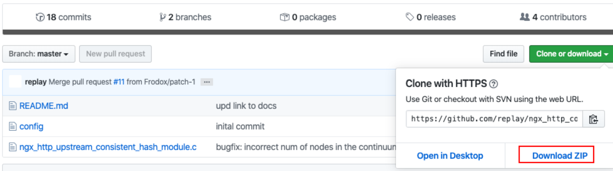

## 2、将下载的压缩包上传到nginx服务器，并解压

## 3）我们已经编译安装过nginx，此时进⼊当时nginx的源码⽬录，执⾏如下命令

```
./configure —add-module=/root/ngx_http_consistent_hash-master
make
make install  
```

## 4） Nginx就可以使⽤啦，在nginx.conf⽂件中配置  

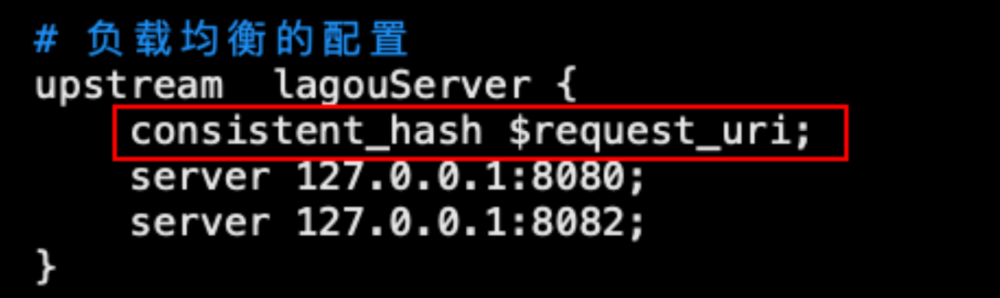
