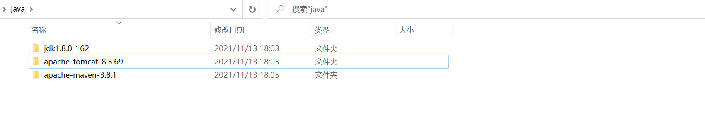
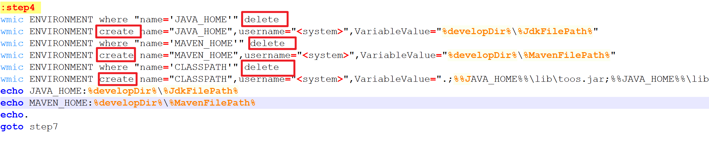
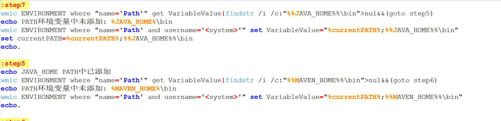
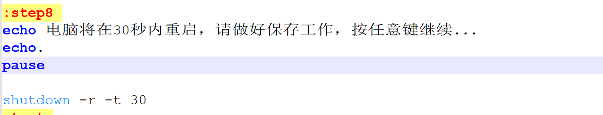
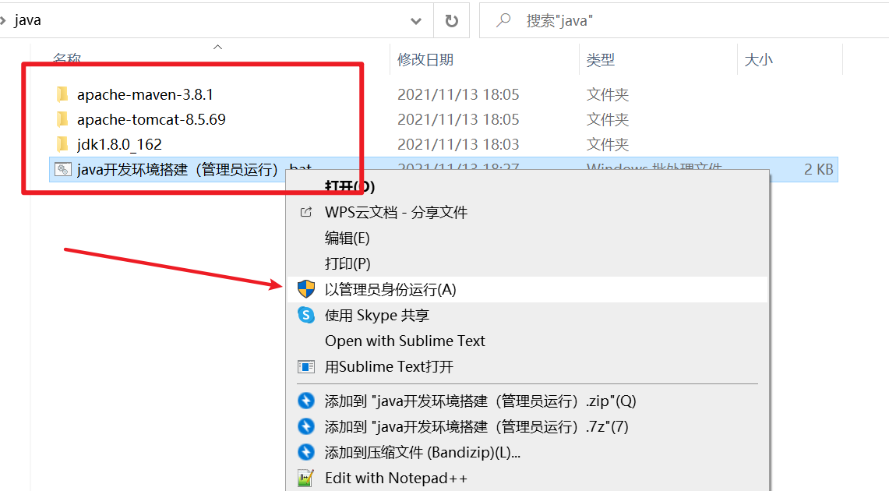
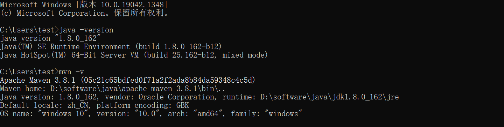

每次换电脑或者换环境开发都需要重新搭建一套java开发环境，如果有一个脚本我们点一下就能装好这一套环境是不是很nice呢~

<!--more-->

# 一、概念理解

## 1、首先我们要明确下通用的一套java环境包括那些：

1. jdk: 这里选择使用最多的1.8版本。这里我们要明白，我们装jdk最后输出的不过就是一个文件夹，里面有java编译运行工具、jre虚拟机环境、依赖 的jar包等。所以我们直接拷贝过来一个这样的目录也是丝毫没有问题的。
2. maven: 我们下载解压出来就是一个文件目录
3. tomcat: 同样下载解压也是一个文件目录

## 2、在开搞前理解下环境变量和classpath的含义和区别

### 一、Path环境变量

这么简单理解吧，我们想要找一个文件，是不是要一层一层找到它所在的文件夹下然后进去才能找到它，现在我们把它所在的文件夹路径配置到`Path`中，那么我们就可在任意目录下都能直接操作这个文件夹下的文件或者工具。

你想要是我们使用`jdk`中`bin`目录下的`javac`编译工具，我们把它的上级文件夹路径配到`Path`中，那么我们在任意目录下都能用`javac`和它同目录下的工具不是很方便嘛。换而言之，我们不配有什么影响吗？虽然没有，但是编译只能在`bin`这个目录下操作不觉得很麻烦吗，并且现在的编译器像`Eclipse`安装前都必须要求配置好环境变量

### 二、classpath环境变量

classpath和path环境变量有什么区别呢，首先我们明白path是让指定目录下的文件在任意目录下可用，那么我们知道java在编写代码时肯定会用到一些jdk自带的工具类，我们的代码依赖这样的jar包，这个时候将我们所依赖的jar包也配置成在任意目录下可导入，是很有意义的，不然这一系列路径开发起来别提多难受了。简单理解

path暴漏的时工具，classpath暴漏的是代码编写所依赖的jar包

## 3、那我们需要配置哪些东西呢

1. java的path环境变量
2. java的classpath环境变量
3. maven的path环境变量

# 二、具体实现

## 1、环境准备

首先我们准备这样一套文件，tomcat不需要配置环境变量，因此脚本并不需要对其进行操作



## 2、编写脚本

1. 新建**java开发环境搭建（管理员运行）.bat**脚本，注意脚本和三个文件目录在同一级别下，并且jdk和maven文件夹进去后bin目录就在里面

也可以替换不同的jdk和maven版本，替换文件夹后，修改`JdkFilePath`和`MavenFilePath`两个参数即可，值为文件夹名称

```
:step1
cd /d %~dp0
set currentPATH=%PATH%
set currentDir=%cd%
::只需要修改这两个参数即可
set JdkFilePath=jdk1.8.0_162
set MavenFilePath=apache-maven-3.8.1
```

2. 脚本执行的核心操作也就是对环境变量的操作，具体为：

使用`wmic` 指令，对`JAVA_HOME`、`MAVEN_HOME`、`CLASSPATH`三条变量先删除，再新建



3. 然后判断Path变量有无配置JAVA_HOME、MAVEN_HOME，如果配置了就不用再操作，未配置则添加



4. 因为操作涉及到环境变量的修改，所以需要重启电脑，将在完成指令的30s后重启




5. 注意：脚本涉及环境变量的修改，执行时一定要使用管理员权限执行




6. 重启后，执行版本查看，发现已经修改成功



# 三、结论

其实这个脚本没有什么别的操作，就是对环境变量的修改，还是蛮简单的，将这个文件夹打个包，传到云端，随去随用不是很方便吗~

[脚本点击下载](java开发环境搭建（管理员运行）.bat)

源码：

```bash
@echo off
cls
echo **********************************************
echo.
echo     一   键   配   置   开   发   环   境
echo.
echo       安装请按任意键，退出直接关闭窗口
echo.
echo **********************************************
echo.
pause

:step1
cd /d %~dp0
set currentPATH=%PATH%
set currentDir=%cd%
::只需要修改这两个参数即可
set JdkFilePath=jdk1.8.0_162
set MavenFilePath=apache-maven-3.8.1

:step2
set developDir=%currentDir%
echo %developDir%
goto step4

:step4
wmic ENVIRONMENT where "name='JAVA_HOME'" delete
wmic ENVIRONMENT create name="JAVA_HOME",username="<system>",VariableValue="%developDir%\%JdkFilePath%"
wmic ENVIRONMENT where "name='MAVEN_HOME'" delete
wmic ENVIRONMENT create name="MAVEN_HOME",username="<system>",VariableValue="%developDir%\%MavenFilePath%"
wmic ENVIRONMENT where "name='CLASSPATH'" delete
wmic ENVIRONMENT create name="CLASSPATH",username="<system>",VariableValue=".;%%JAVA_HOME%%\lib\toos.jar;%%JAVA_HOME%%\lib\dt.jar"
echo JAVA_HOME:%developDir%\%JdkFilePath%
echo MAVEN_HOME:%developDir%\%MavenFilePath%
echo.
goto step7

:step7
wmic ENVIRONMENT where "name='Path'" get VariableValue|findstr /i /c:"%%JAVA_HOME%%\bin">nul&&(goto step5)  
echo PATH环境变量中未添加: %JAVA_HOME%\bin 
wmic ENVIRONMENT where "name='Path' and username='<system>'" set VariableValue="%currentPATH%;%%JAVA_HOME%%\bin"
set currentPATH=%currentPATH%;%%JAVA_HOME%%\bin
echo.

:step5
echo JAVA_HOME PATH中已添加
wmic ENVIRONMENT where "name='Path'" get VariableValue|findstr /i /c:"%%MAVEN_HOME%%\bin">nul&&(goto step6)  
echo PATH环境变量中未添加: %MAVEN_HOME%\bin 
wmic ENVIRONMENT where "name='Path' and username='<system>'" set VariableValue="%currentPATH%;%%MAVEN_HOME%%\bin"
echo.

:step6
echo MAVEN_HOME PATH中已添加

:step8
echo 电脑将在30秒内重启，请做好保存工作，按任意键继续...
echo.
pause

shutdown -r -t 30
:test

@echo.
:end
pause
```
