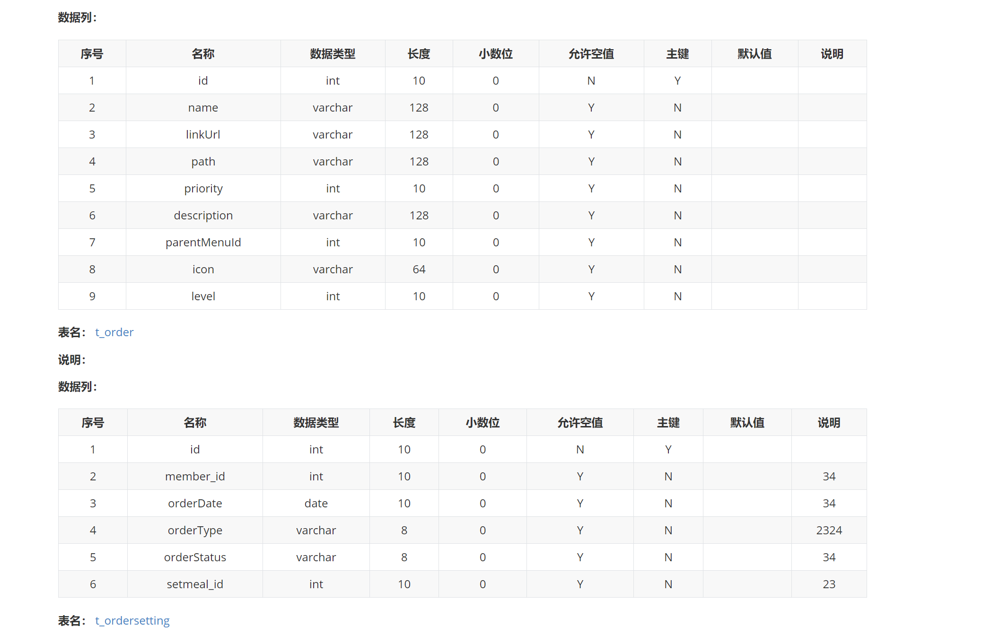
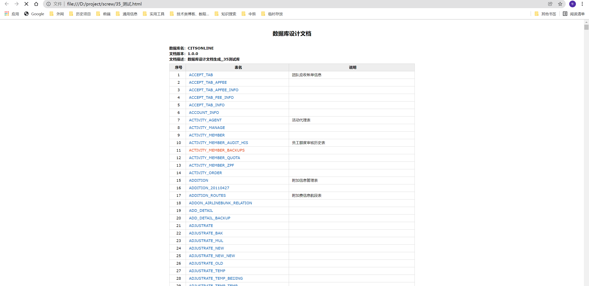

偶然间，发现了一个非常好用的项目，这个项目能够快速的将数据库表结构以文档形式导出，解决了之前项目要验收写数据库设计文档时的困扰。有了这个工具的加持，一键导出系统表结构，对快速理解项目的整体情况有很大帮助~~，有兴趣的小伙伴可以看看。

<!--more-->

# 一、项目来源

项目来源于GItHub上的一个开源项目，作者将这个项目命名为 `screw`，含义为螺丝钉，寓意为：工具虽小，但作用很大，是开发中重要的工具

GitHub地址：[点击跳转](https://github.com/pingfangushi/screw)

# 二、具体使用

## 1、导入依赖

新建一个Maven项目，在pom.xml文件中添加依赖，拉下相关jar包

下面示例添加了`mysql`和`oracle`两个驱动依赖，可根据项目情况自行选择

```
<dependency>
    <groupId>cn.smallbun.screw</groupId>
    <artifactId>screw-core</artifactId>
    <version>1.0.5</version>
</dependency>

<!-- HikariCP -->
<dependency>
    <groupId>com.zaxxer</groupId>
    <artifactId>HikariCP</artifactId>
    <version>3.4.5</version>
</dependency>

<!--mysql driver-->
<dependency>
    <groupId>mysql</groupId>
    <artifactId>mysql-connector-java</artifactId>
    <version>5.1.40</version>
</dependency>

<!-- https://mvnrepository.com/artifact/com.oracle.database.jdbc/ojdbc8 -->
<dependency>
    <groupId>com.oracle.database.jdbc</groupId>
    <artifactId>ojdbc8</artifactId>
    <version>21.1.0.0</version>
</dependency>
```

## 2、新建JAVA文件

新建一个Test.java普通的java类，将代码拷贝到main方法中，导入相关jar包。

修改配置信息

1. 连接驱动

   1. mysql：`com.mysql.jdbc.Driver`
   2. oracle：`oracle.jdbc.driver.OracleDriver`

2. jdbcUrl

   1. mysql：`jdbc:mysql://127.0.0.1:3306/health?characterEncoding=UTF-8`
   2. oracle：`jdbc:oracle:thin:@xxx.xx.x.xx:1521:xxx?characterEncoding=UTF-8`

3. username和password

   配置数据源的账号和密码

4. fileOutputDir

​		配置文档输出路径地址

5. fileType 	

   文档输出类型，默认 `EngineFileType.HTML`以网页形式输出，可以修改

   1. EngineFileType.HTML ：HTML文件	
   2. EngineFileType.WORD：WORD文件	
   3. EngineFileType.MD  Markdown文件	

6. fileName

​		输出文件名自定义修改

```
import cn.smallbun.screw.core.Configuration;
import cn.smallbun.screw.core.engine.EngineConfig;
import cn.smallbun.screw.core.engine.EngineFileType;
import cn.smallbun.screw.core.engine.EngineTemplateType;
import cn.smallbun.screw.core.execute.DocumentationExecute;
import cn.smallbun.screw.core.process.ProcessConfig;
import com.zaxxer.hikari.HikariConfig;
import com.zaxxer.hikari.HikariDataSource;

import javax.sql.DataSource;
import java.util.ArrayList;

public class Test {

    /*
     文档生成
    */
    public static void main(String[] args) {
        //数据源
        HikariConfig hikariConfig = new HikariConfig();
        hikariConfig.setDriverClassName("com.mysql.jdbc.Driver");
        hikariConfig.setJdbcUrl("jdbc:mysql://127.0.0.1:3306/health?characterEncoding=UTF-8");
        hikariConfig.setUsername("root");
        hikariConfig.setPassword("Gepoint");
        //设置可以获取tables remarks信息
        hikariConfig.addDataSourceProperty("useInformationSchema", "true");
        hikariConfig.setMinimumIdle(2);
        hikariConfig.setMaximumPoolSize(5);
        DataSource dataSource = new HikariDataSource(hikariConfig);
        //生成配置
        EngineConfig engineConfig = EngineConfig.builder()
                //生成文件路径
                .fileOutputDir("D:\\project\\screw\\")
                //打开目录
                .openOutputDir(true)
                //文件类型
                .fileType(EngineFileType.HTML)
                //生成模板实现
                .produceType(EngineTemplateType.freemarker)
                //自定义文件名称
                .fileName("数据库表结构文档").build();

        //忽略表
        ArrayList<String> ignoreTableName = new ArrayList<>();
        ignoreTableName.add("test_user");
        ignoreTableName.add("test_group");
        //忽略表前缀
        ArrayList<String> ignorePrefix = new ArrayList<>();
        ignorePrefix.add("test_");
        //忽略表后缀
        ArrayList<String> ignoreSuffix = new ArrayList<>();
        ignoreSuffix.add("_test");
        ProcessConfig processConfig = ProcessConfig.builder()
                //指定生成逻辑、当存在指定表、指定表前缀、指定表后缀时，将生成指定表，其余表不生成、并跳过忽略表配置
                //根据名称指定表生成
                .designatedTableName(new ArrayList<>())
                //根据表前缀生成
                .designatedTablePrefix(new ArrayList<>())
                //根据表后缀生成
                .designatedTableSuffix(new ArrayList<>())
                //忽略表名
                .ignoreTableName(ignoreTableName)
                //忽略表前缀
                .ignoreTablePrefix(ignorePrefix)
                //忽略表后缀
                .ignoreTableSuffix(ignoreSuffix).build();
        //配置
        Configuration config = Configuration.builder()
                //版本
                .version("1.0.0")
                //描述
                .description("数据库设计文档生成")
                //数据源
                .dataSource(dataSource)
                //生成配置
                .engineConfig(engineConfig)
                //生成配置
                .produceConfig(processConfig)
                .build();
        //执行生成
        new DocumentationExecute(config).execute();
    }
}
```


# 三、执行代码

执行完成后，在配置的路径下即生成对应格式的文档

## 示例一



## 示例二



