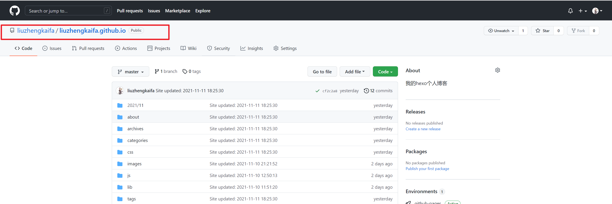
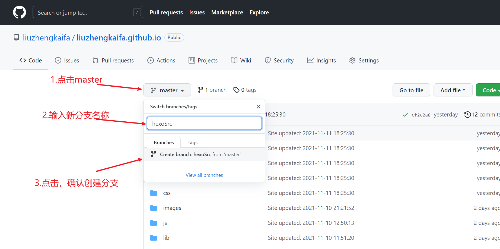
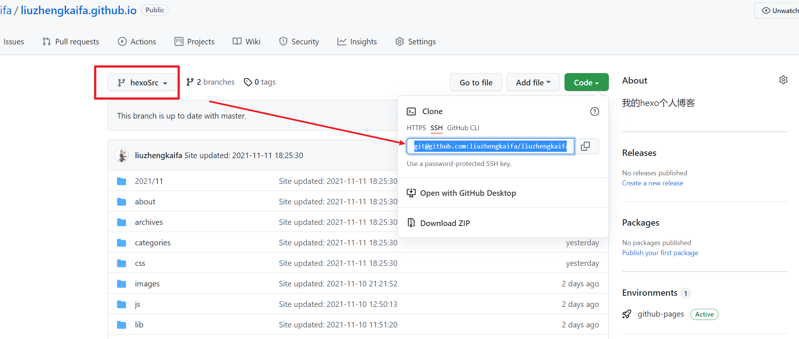
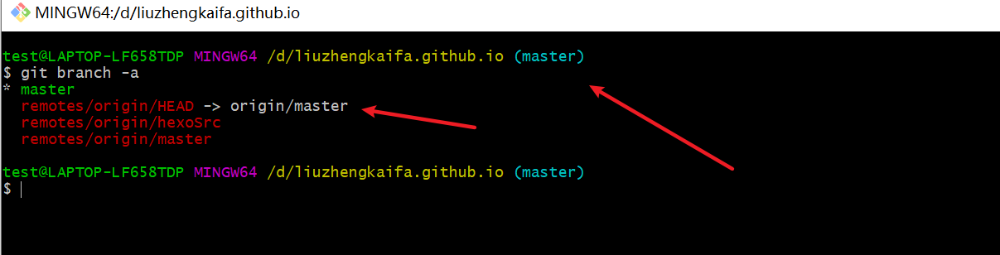
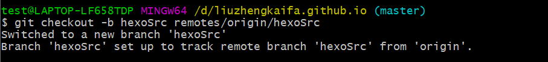
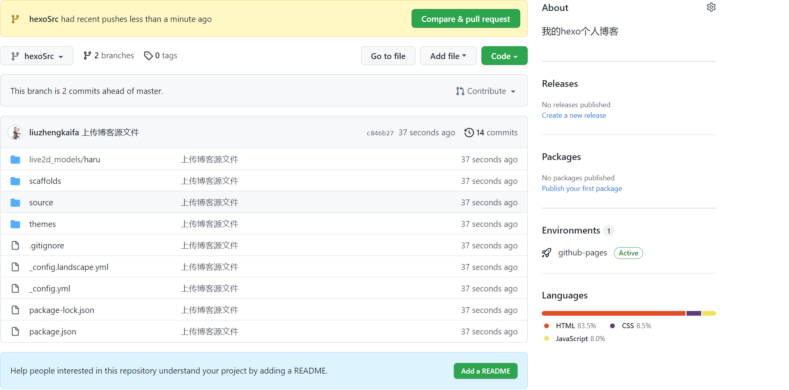
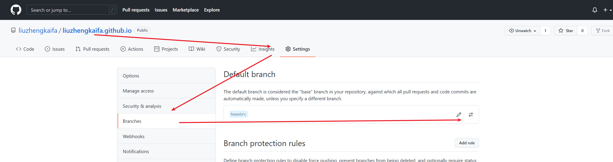
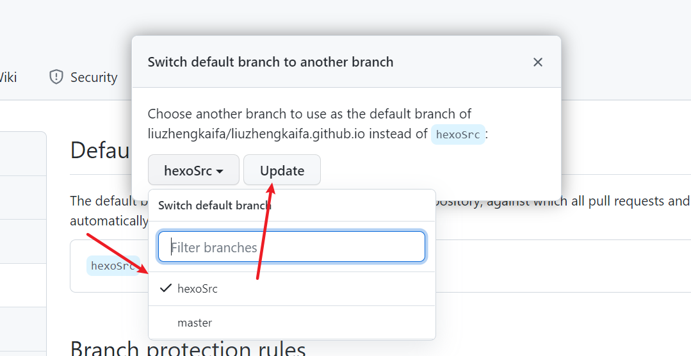
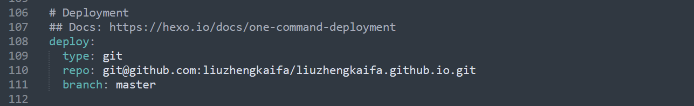

刚了解hexo的时候就在考虑换电脑怎么转移博客，偶然机会看到了好朋友的博客，感觉很有帮助，然后也在这边做个记录，冲冲博客数量吧，哈哈哈哈~

毕竟只是有限，只能做个搬运工[好朋友的博客](https://small-brilliant.github.io/2021/03/12/%E6%8D%A2%E7%94%B5%E8%84%91%E4%BA%86%E6%88%91%E7%9A%84Bolg%E6%80%8E%E4%B9%88%E5%8A%9E/)；博客搞得相当好，有兴趣可以收藏哈哈哈哈~

<!--more-->

# 一、思路

备份的大致思路就是

1. 在原有静态文件的GIt仓库新建一个分支，克隆到本地，然后本地在这个分支的管控下删除所有内容后提交，这样就相当于有了一个干净的分支
2. 把博客的文件目录复制过来，然后再删除复制过来的版本信息，提交后push到远程分支
3. 新电脑安装node.js，hexo后拉下该分支，使用该分支开发

# 二、具体步骤

## 1、建立一个新的分支hexoSrc

#### （一）GitHub进入到hexo项目里



#### （二）新建 分支

点击master按钮，在弹出的框内输入新的分支名称，例如我的起名**hexoSrc**



## 2、将原有的博客内容push到新分支上

#### （一）在任意目录下打开Git Bash命令窗口，克隆新分支内容




#### （二）清楚拉下来的分支内容提交，然后拷贝一份源文件提交 

1. 第一次新拉下来分支是`master`，这是我们需要切换到我们创建的新分支上去



2. 执行git `checkout -b` <新分支名称> <远程分支> 切换到新分支



3. 删除除去.git目录外所有信息，并提交

```
git add -A
git commit -m "删除该分支内容，准备放源文件"
git push
```

4. 上传源文件。将我们之前写博客的文件夹里面的所有文件复制过来，**除了**`.deploy_git`。**如果你有自定义的主题的话**，一定要删除主题文件中的`.git`文件夹，因为`git`不能嵌套上传。然后在这个文件夹打开`git bash`。输入下面命令，就上传了。

```
git add .
git commit –m "上传博客源文件"
git push 
```



#### （三）github将新建的分支hexoSrc设置为默认分支

依次点击 settings>>Branches>>switch



在弹出的框内选择新建的分支hexoSrc,点击update



#### （四）将博客源码纳入git版本控制

我们可以在一个空文件夹执行克隆操作，拉下来一份之前提交下来的源码，将文件夹下的.git拷贝到我们现在博客的根目录下即可

因为博客静态文件在配置里设置的提交分支master,所以我们本地保持分支状态和默认分支一样为hexoSrc即可



我们在执行完hexo clean 、hexo g、hexo d后即可通过

```
git add .
git commit -m "提交博客源文件"
git push origin hexoSrc
```

来完成源码的上传

## 3、新电脑环境使用新分支继续博客编写

1. 安装`git`和`node.js`
2. 设置`git`全局邮箱和用户名
3. 新电脑生成公钥，将公钥配置到Github上

```
git config --global user.name "yourgithubname"
git config --global user.email "yourgithubemail"
```

3. 安装`hexo`但是不需要初始化。

```
npm install hexo-cli -g
```

4. 然后进入克隆到的文件夹。安装环境

```
git clone XXX.git
npm install
npm install hexo-deployer-git --save
```

5. 验证

```
hexo g
hexo s
```

6. 然后就可以开始写你的新博客了。每次写完都要把源文件上传一下。

```
git add .
git commit –m "xxxx"
git push 
```

7. 如果是在已经编辑过的电脑上，已经有clone文件夹了，那么，每次只要和远端同步一下就行了。

```
git pull --rebase
```

