一、下载安装Nodejs

[官网下载地址](https://nodejs.org/en/)

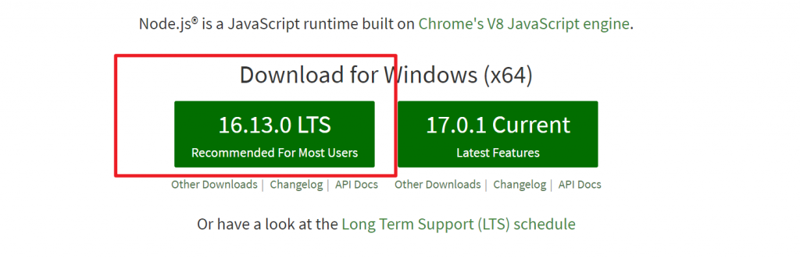

<!-- more -->

安装 下一步下一步正常安装即可

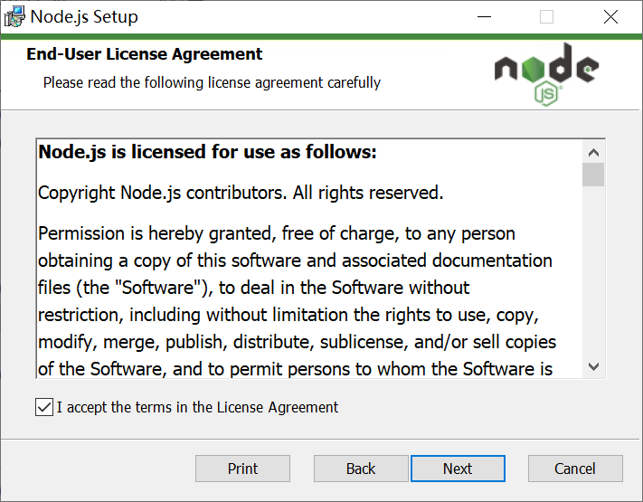

 二、配置环境变量

<ol><li>找到nodejs安装路径，我本地安装路径：D:\installsoftware\nodejs</li><li>将安装路径配置到path： 计算机-属性-高级系统设置-环境变量-系统变量-path </li><li>校验，win+r 输入cmd，在命令窗户输入 node -v查看nodejs版本，正常输出则安装成功</li></ol>

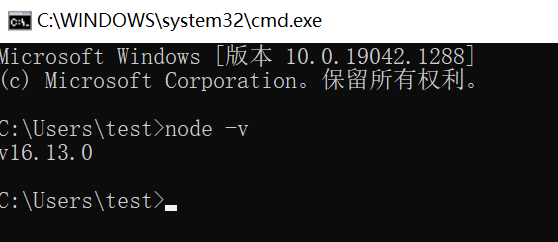

三、安装hexo是借助npm安装，由于国内安装镜像源速度很慢，可以借助淘宝cnpm安装

1、命令行输入：npm install -g cnpm --registry=https://registry.npm.taobao.org

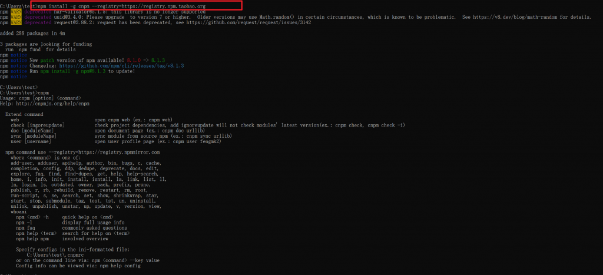

2、 命令行输入：cnpm install -g hexo-cli 安装hexo

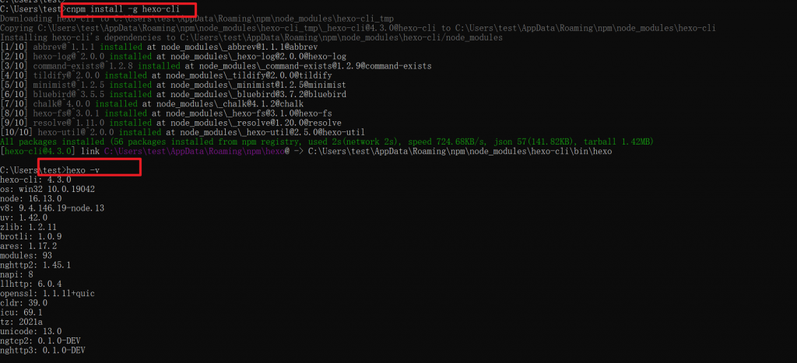

 3、 新建blog目录，存放博客

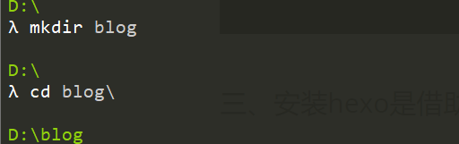

4、 命令行输入 hexo init 初始化hexo

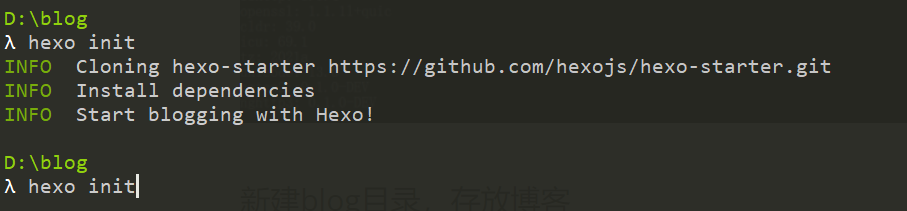

5、 此时hexo安装已经完成，我们通过输入 ls -l会发现hexo初始化会生成以下文件

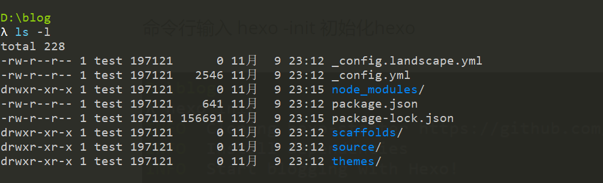

6、安装完成，输入命令：hexo s  来启动hexo , 启动完成，浏览器输入http://localhost:4000/ 即可访问hexo博客

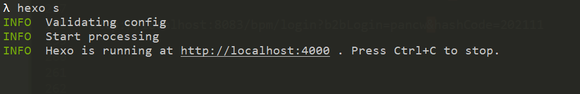

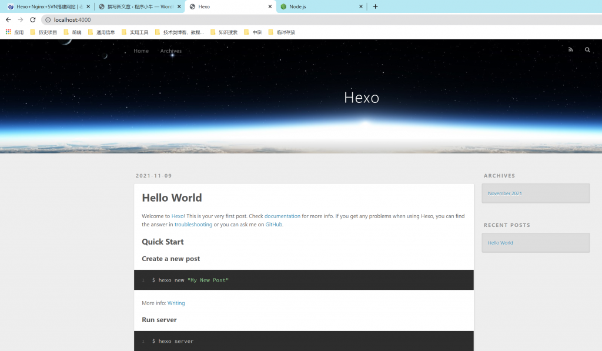

 四、使用hexo编写博客

1、写一篇新文章

命令行输入： hexo n "我的第一篇博客文章" 

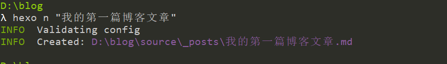

使用编辑器或者其他工具修改博客文章

然后命令行输入：hexo clean 先清理一下

然后命令行输入：hexo g 重新生成一下博客

最后命令行输入：hexo s 启动一下，启动完成浏览器输入localhost:4000即可访问博客

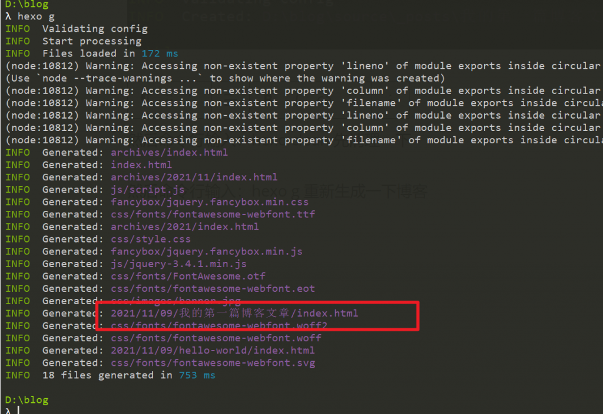

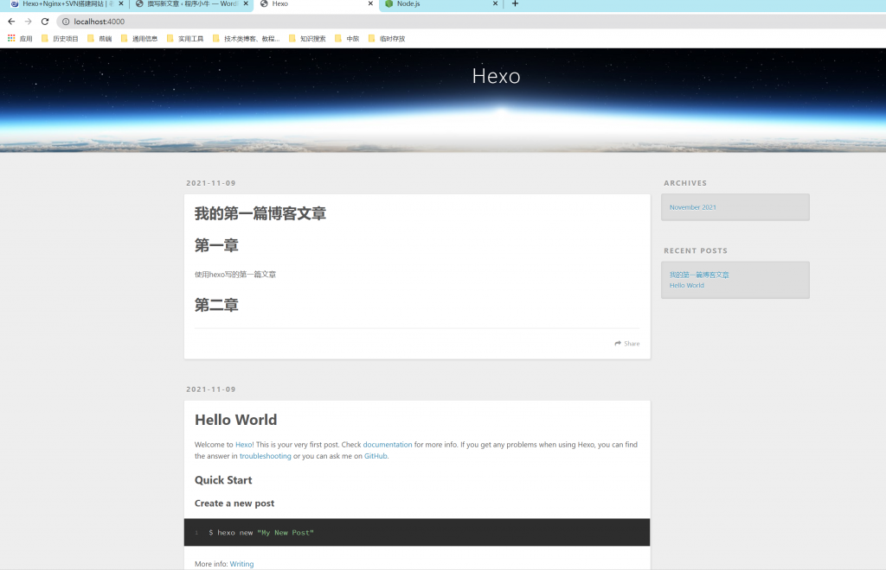

至此hexo博客的搭建和编写已经完成

 五、将hexo博客部署到远端（github）,通过github即可访问博客 

1、github 新建一个仓库

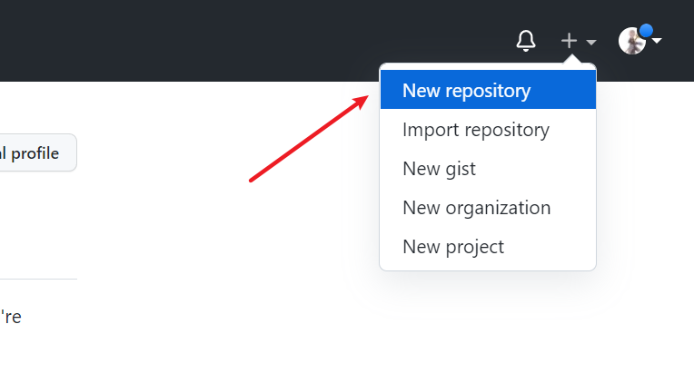

2、注意仓库命名，然后点击create创建仓库即可

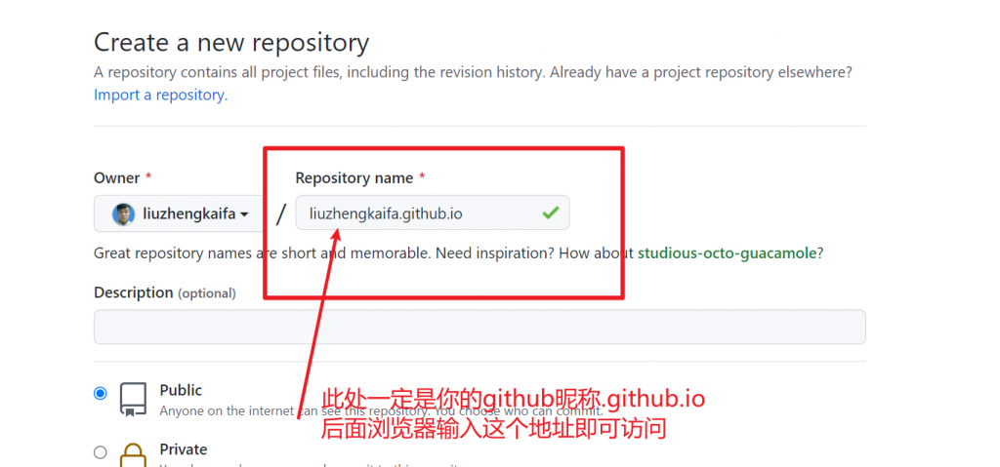

 3、需要在我们间的blog博客文件夹下装一个git部署插件

通过命令行输入：cnpm install --save hexo-deployer-git

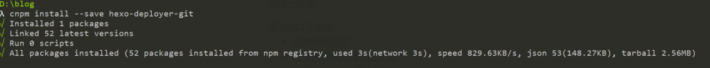

4、需要设置blog目录下的_config.yml，注意yml格式使用空格缩进

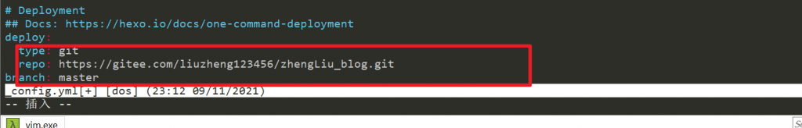

5、保存后，命令行输入：hexo -d 即可部署远程博客，github登录方式调整可能有问题，解决方案看文章下方

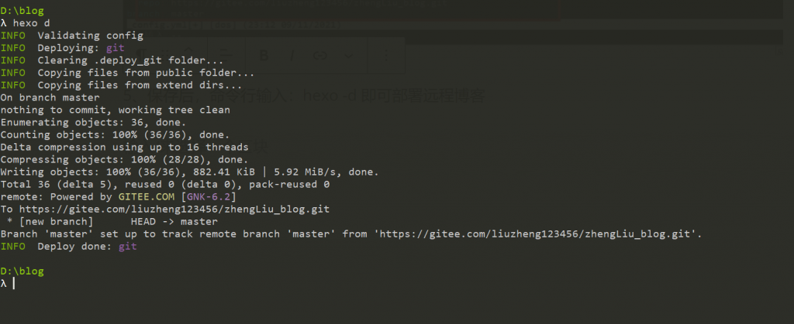

6、部署完成，通过访问 https://liuzhengkaifa.github.io/ 查看博客内容。 

六、问题

  在命令行 hexo d 部署博客时出现错误

remote: Support for password authentication was removed on August 13, 2021. Please use a personal access token instead.

原因时：GitHub不再支持密码验证解决方案：SSH免密与Token登录配置，基于方便我采用了ssh免密方式登录，可参考以下步骤

1、本地生成公钥

<pre class="wp-block-preformatted">ssh-keygen -t rsa -b 4096 -C "uestchan@sina.com"</pre>

接着会提示这个公钥私钥的保存路径-建议直接回车就好（默认目录里)

接着提示输入私钥密码passphrase - 如果不想使用私钥登录的话，私钥密码为空，直接回车

 2、将公钥配置到github中，用编辑器打开 C:\Users\test.ssh 目录下的 id_rsa.pub

将内容粘贴到githun配置处

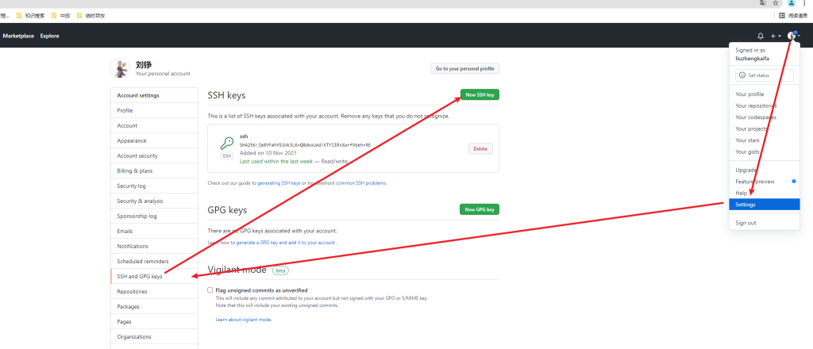

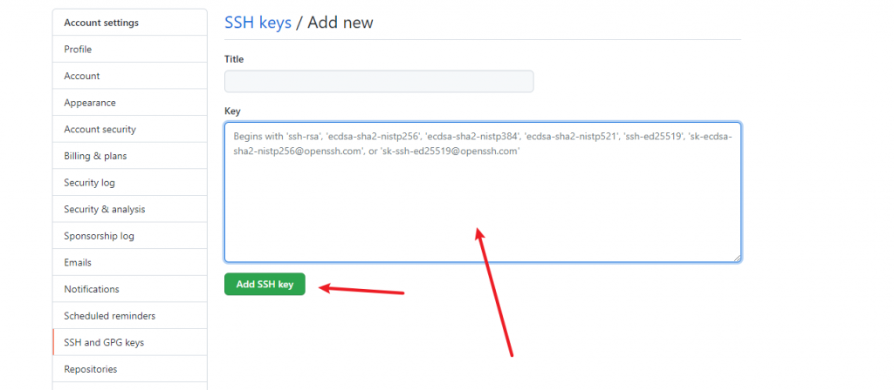

3、将_config.yml文件的repo地址改为 ssh方式地址，即可完成正常操作

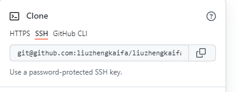