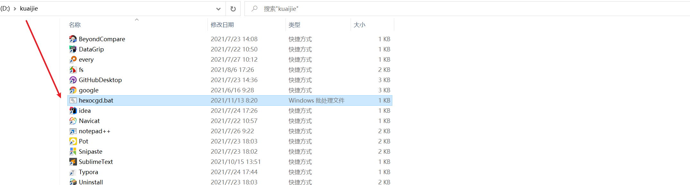
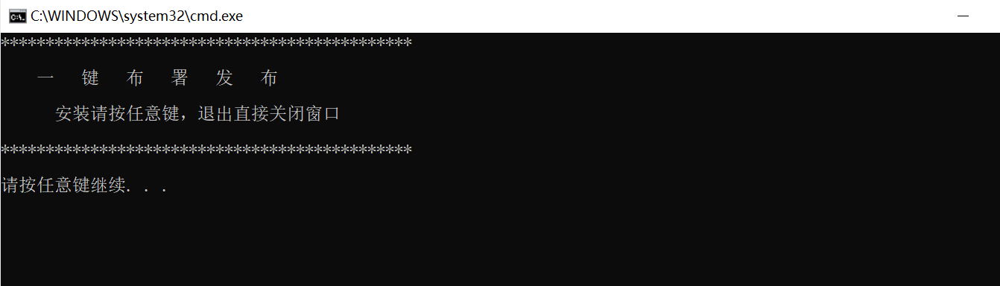
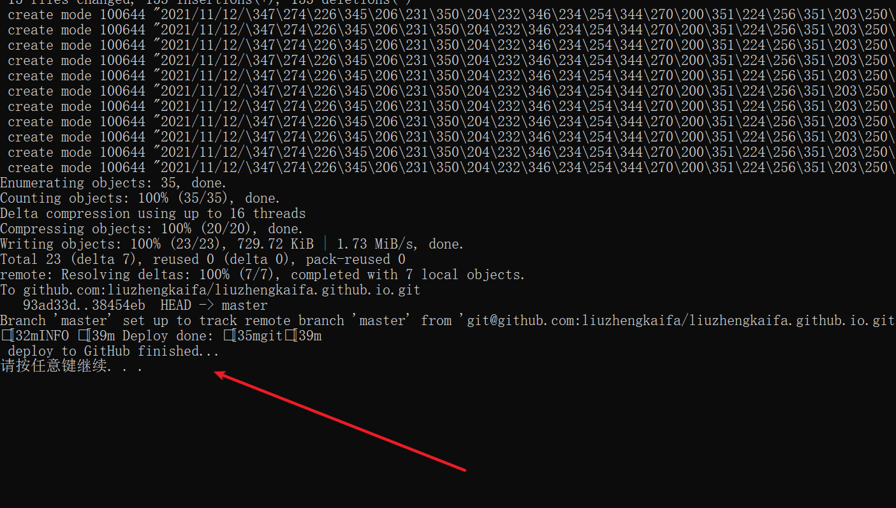

事情起因是每次修改了博文都要执行 `hexo clean` `hexo g` `hexo d`一套来清除，重新编译，部署完成一套操作，这对于追求极客效率的开发来说必是要想办法优化的，怎么做编写一个一键部署的脚本呢，考虑到之前还没怎么编写过bat批处理脚本，本次借着时间来尝试一下

<!--more-->	

# 一、目标

1、执行脚本可以确认执行或者关掉窗口不执行，确认执行将依次执行`hexo clean` 和 `hexo g`指令

2、弹出指示询问是否部署到Github上，输入yes将部署，输入no，提示自己选择了不部署，然后关闭窗口即可

3、在任意界面能够执行脚本，这个之前分享的技巧可以结合，具体请移步通过[指令快速打开软件](https://liuzhengkaifa.github.io/2021/11/11/%E9%80%9A%E8%BF%87%E6%8C%87%E4%BB%A4%E5%BF%AB%E9%80%9F%E6%89%93%E5%BC%80%E8%BD%AF%E4%BB%B6/#more)

# 二、具体实现

## 1、实现一

1. 先是编写确认，主要是`pause`指令，作用是会在dos窗口显示 请按任意键继续. . . 如果想反悔不执行了直接关闭dos窗口即可

```
@echo off
cls
echo **********************************************
echo.
echo     一   键   布   署   发   布      
echo.
echo       安装请按任意键，退出直接关闭窗口
echo.
echo **********************************************
echo.
pause
```

2. 依次执行`hexo clean` 和 `hexo g`指令，注意使用到了call指令，放在了hexo指令的前面，主要作用是执行完指令后任然返回到当前窗口，可以继续执行下面指令，不然一些指令本身带退出指令，就会造成下面指令无法执行。具体作用还请各位各自查询之~~~

```
:step1
cd /d d:\blog
echo Please wait
call hexo clean
echo  clean finished...

:step2
call hexo g
cls
echo  generate finished...
```

3. 询问是否部署到`GitHub`，这里主要是做了一个输入判断

```
:step3
set /p o=要部署到GitHub上吗? (YES NO):
if /i "%o%"=="yes" goto yes
if /i "%o%"=="no" goto no
goto step3
:yes
call hexo d
echo  deploy to GitHub finished...
pause
:no
echo 你选择了不部署！
pause
```


##  3、实现三

根据我们之前的技巧，只需要将我们编写的脚本放到加入环境变量的文件夹中即可



然后快捷键`WIn+R`调出运行框，输入`hexocgd.bat`确定即可


## 三、实现效果




选择no,不部署


选择yes,部署



# 四、脚本获取

[hexocdg.bat脚本获取](hexocgd.bat)

```
@echo off
cls
echo **********************************************
echo.
echo     一   键   布   署   发   布      
echo.
echo       安装请按任意键，退出直接关闭窗口
echo.
echo **********************************************
echo.
pause

:step1
cd /d d:\blog
echo Please wait
call hexo clean
echo  clean finished...

:step2
call hexo g
echo  generate finished...

:step3
set /p o=要部署到GitHub上吗? (YES NO):
if /i "%o%"=="yes" goto yes
if /i "%o%"=="no" goto no
goto step3
:yes
call hexo d
echo  deploy to GitHub finished...
pause
:no
echo 你选择了不部署！
pause

```

