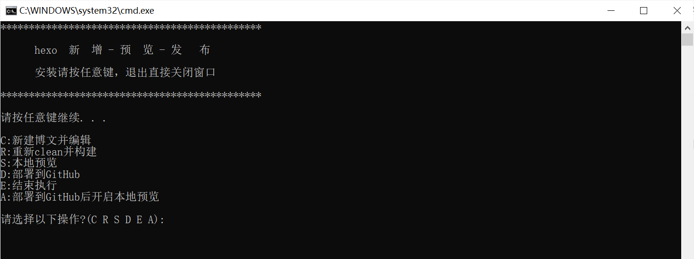
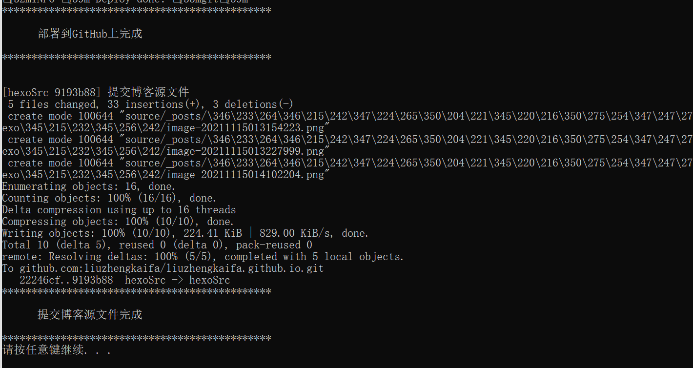

上一篇一键发布脚本写好了，但是感觉还是不够方便，所以又进行了一番优化，优化的点主要有以下几方面

1. 脚本支持**新增博文**功能，只需输入要新建的文章名称，**自动创建博客文章**，**并且会自动运行**`typora`编辑器打开这篇新增博文
2. **支持重复**`clean`、`generate`，有时候一次clean编译会由于文件正在使用或者其他原因没有成功，这时我们肯定不希望脚本就此停止了，而是再解决完问题后在这次执行中继续`clean`,编译
3. **支持本地运行**，可以通过输入选项来开启本地预览
4. 支持**单独部署**到`GitHub`上，解决上一个博客每次部署前都会clean编译问题,有时并不需要
5. 支持部署到`GitHub`后的同时，开启本地预览

哈哈哈~~至此，是不是觉得这个脚本功能还是挺全的

<!--more-->	

# 一、脚本整体架构

1. 脚本采用类似Java中Switch-Case的语法，通过输入的指令来进行对应功能执行



2. 脚本可复用性提高，只需要修改几个参数即可实现拿来即用，几个参数均放置在脚本内容上方

```
::此处配置编译器路径，自定义调整
set idePath="D:\installsoftware\Typora\Typora"

::此处配置编译器名称，搭配上一条调整
set ideName="Typora.exe"

::博客根目录
set blogRootPath="D:\blog"

::博文所在目录
set blogSrcPath="%blogRootPath%\source\_posts"
```


# 二、具体功能

## 1、新增博文

核心代码如下：

```
::新建博文并编辑
:step4
set /p name=input name:
echo name:%name%
echo please wait
call hexo new post %name%
call start /d "%idePath%" %ideName% "%blogSrcPath%\%name%.md"
pause
```

1. 主要是接收一个博文名称，执行hexo new \<name> 指令新增博文
2. 使用`start`指令运行typora可执行文件打开这篇已创建的博文

## 2、单独部署到GitHub

这个功能没有什么，就是输入指令，然后运行了对应的`hexo -d` 指令

## 3、可重复clean 编译

哈哈哈，这地方取了个巧，就是在`clean`,`generate` 之后，使用goto指令再次指向功能菜单那一步骤

## 4、可单独本地预览

这...可不就是把第二步拿来替换了个指令嘛`hexo s`

# 三、结论

整体看上去没什么技术含量，实际上确实没有，哈哈哈，只是把功能做了个整合。有兴趣的朋友可以试一试哈哈哈

[完成版脚本下载点击](hexoopt.bat)

源码：

```bash
@echo off
cls
echo **********************************************
echo.
echo       hexo  新  增 - 预  览 - 发   布       
echo.
echo       安装请按任意键，退出直接关闭窗口
echo.
echo **********************************************
echo.
pause

::此处配置编译器路径，自定义调整
set idePath="D:\installsoftware\Typora\Typora"
::此处配置编译器名称，搭配上一条调整
set ideName="Typora.exe"

::博客根目录
set blogRootPath="D:\blog"
::博文所在目录
set blogSrcPath="%blogRootPath%\source\_posts"

::切换到博客根目录
cd /d %blogRootPath%

:step1
echo.
echo C:新建博文并编辑
echo R:重新clean并构建
echo S:本地预览
echo D:部署到GitHub
echo E:结束执行
echo A:部署到GitHub后开启本地预览
echo.
set /p o=请选择以下操作?(C R S D E A):
if /i "%o%"=="c" goto c
if /i "%o%"=="r" goto r
if /i "%o%"=="s" goto s
if /i "%o%"=="d" goto d
if /i "%o%"=="e" goto e
if /i "%o%"=="a" goto a

goto step1
:d
call hexo d	
echo  部署到GitHub上完成...
pause
exit
:e
echo 脚本执行结束！
pause
exit
:s
call hexo s
echo  本地启动完成...预览地址：http://localhost:4000/
pause
exit
:A
call hexo d
echo 部署到GitHub上完成...
call hexo s
echo 本地启动完成...预览地址：http://localhost:4000/
pause
exit
:C
goto step4
pause
exit
:R
goto step2

::clean
:step2
echo Please wait
call hexo clean
echo clean清除完成...

::generate
:step3
call hexo g
echo generate 构建完成...
goto step1

::新建博文并编辑
:step4
set /p name=input name:
echo name:%name%
echo please wait
call hexo new post %name%
call start /d "%idePath%" %ideName% "%blogSrcPath%\%name%.md"
pause
```

# 四、后续优化

本次优化实现了执行完hexo d部署静态文件后，执行了上传博客源文件的步骤，这样保证不经博文是最新的，博客的源文件也是最新的，换个电脑拉下来即可接着写内容，实现效果



修改部分内容如下，需要的可以改在脚本上即可：

```
:d
call hexo d	
echo **********************************************     
echo.
echo       部署到GitHub上完成
echo.
echo **********************************************
echo.
echo.
git add .
git commit -m "提交博客源文件"
git push origin hexoSrc
echo **********************************************     
echo.
echo       提交博客源文件完成
echo.
echo **********************************************
pause
exit
```

