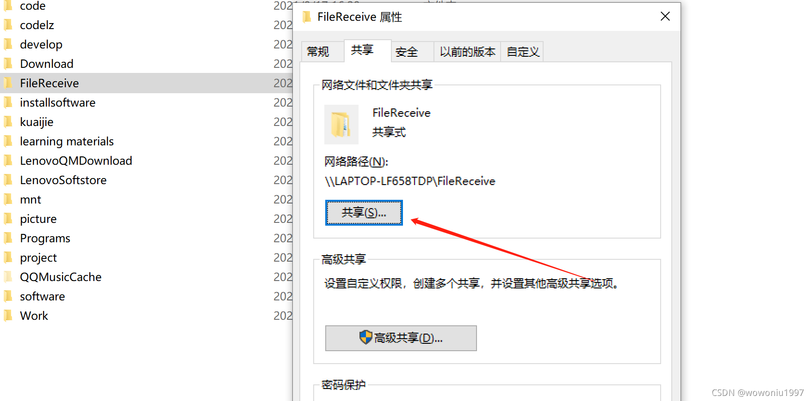
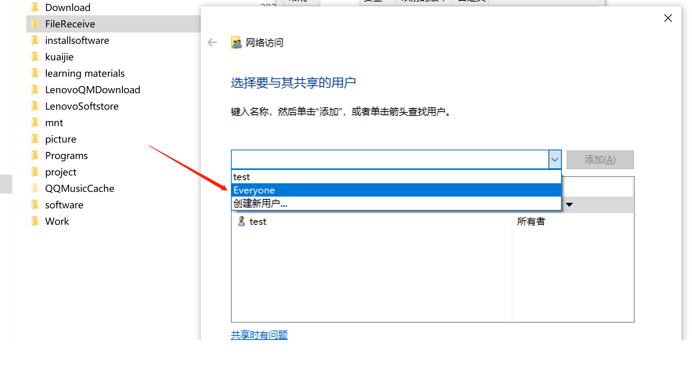
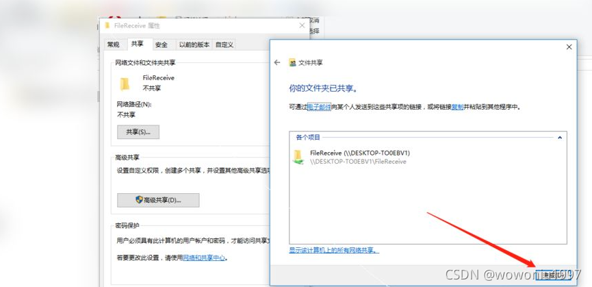
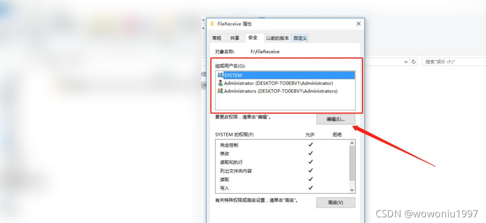
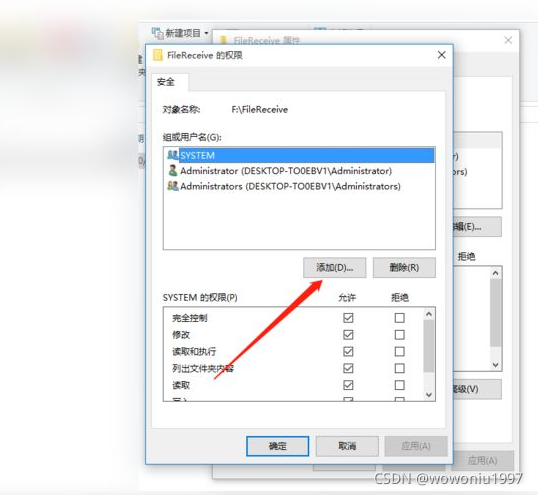
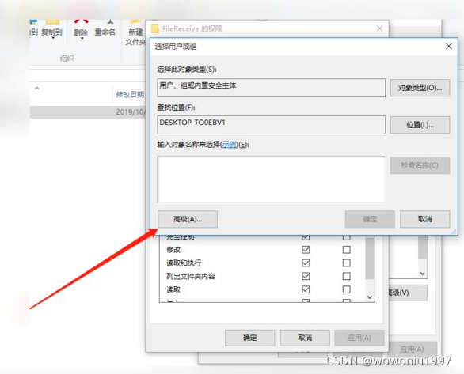
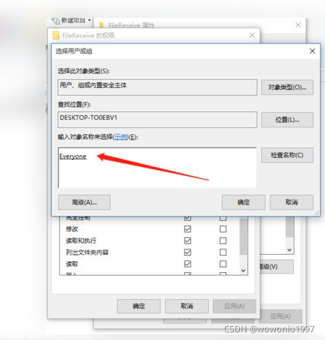
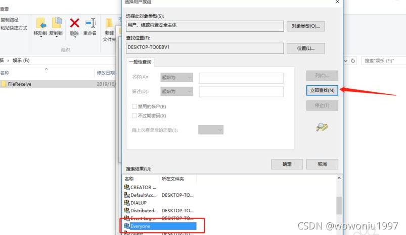
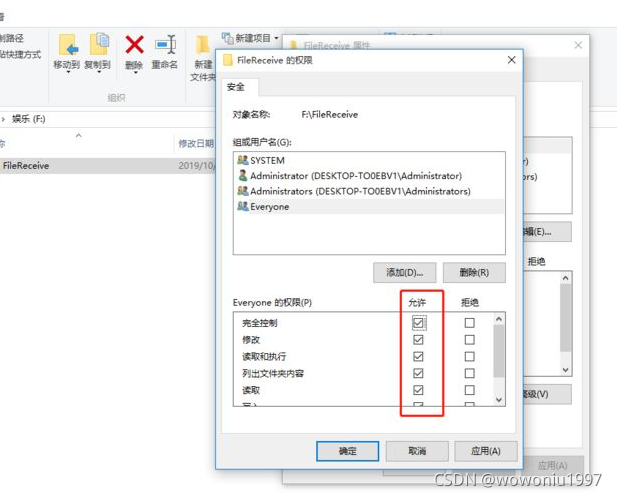
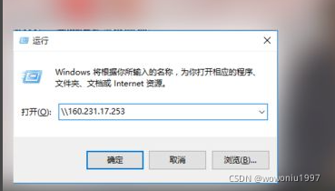

**背景：在办公时，你要发给小明一个很大的文件，u盘存放不下，且传输速度慢，怎么解决**

**一、在你一个本地空间新建一个文件夹FileReceive**

<!--more--> 

**二、右键属性，点击共享**

 **三、选择共享账号为everyone,这之后会有一个窗口提示共享已完成，点击右下角的“完成”按钮**

 **四、虽然现在共享给了Everyone，但是组和用户那里却没有Everyone，需要另行添加。点击箭头所指处的“编辑”。**

 

 **五、在“FileReceive的权限”窗口中点击箭头所指处的“添加”。**

 

 **六、在“选择组和用户”窗口中点击“高级”。** 

 

  **七、点击“立即查找”，在搜索结果中找到Everyone，双击添加，然后点击确定。**

 

  **八、勾选Everyone的所有权限，如下图所示，然后点击“应用”，“确定”。** 

  **九、使用win+r快捷键调出运行窗口，输入\\+IP地址，连接至电脑B的共享。** 

