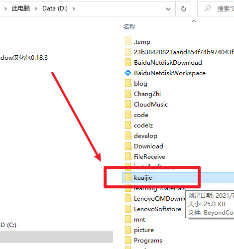
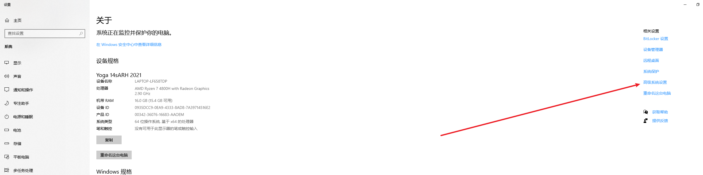
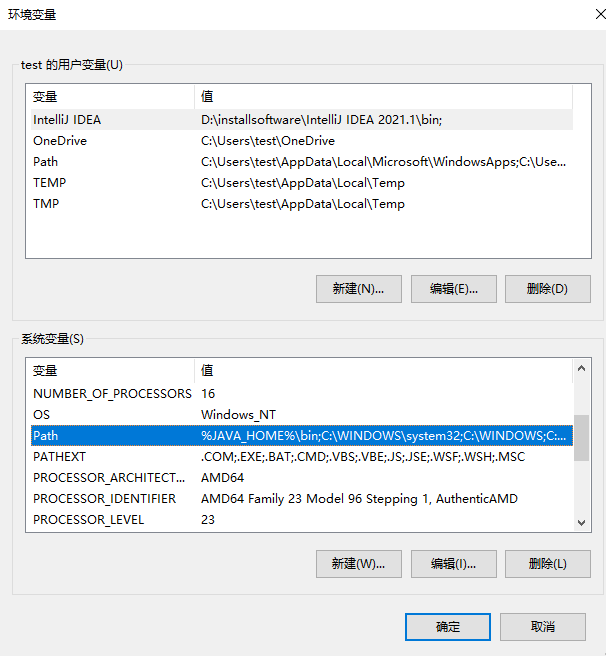
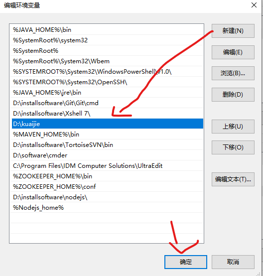
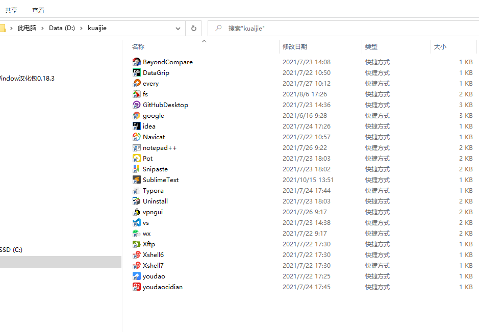
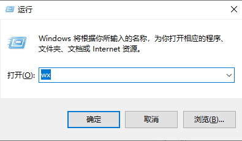

每次桌面打开一堆页面，再想要去打开一个新的软件，如何不用返回屏幕也不用触碰鼠标快速秒开软件呢，

<!--more-->

# 一、建立文件夹

1. 首先在任意位置建个文件夹

   

# 二、将文件目录配到环境变量中

1. 点击桌面此电脑 右击 选择属性
2. 点击高级系统设置，弹出页面点击环境变量

3. 选中Path然后点解编辑

4. 点击新建，将新建的文件夹路径配置进去，然后点击确定完成操作

# 三、存放快捷方式

**将一些常用的软件快捷方式按照自己习惯命名放到新建的文件夹中**

**这样在任意界面都可以通过快捷键Win+R调出左下角运行输入框**

**输入自己命名的快捷方式（直接输过的敲一个字母就会带出来）回车边立即打开相应软件**

是不是相当nice~~~~

